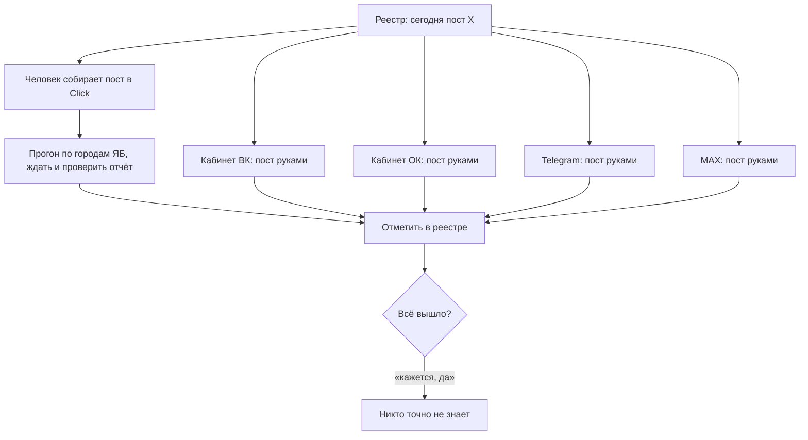
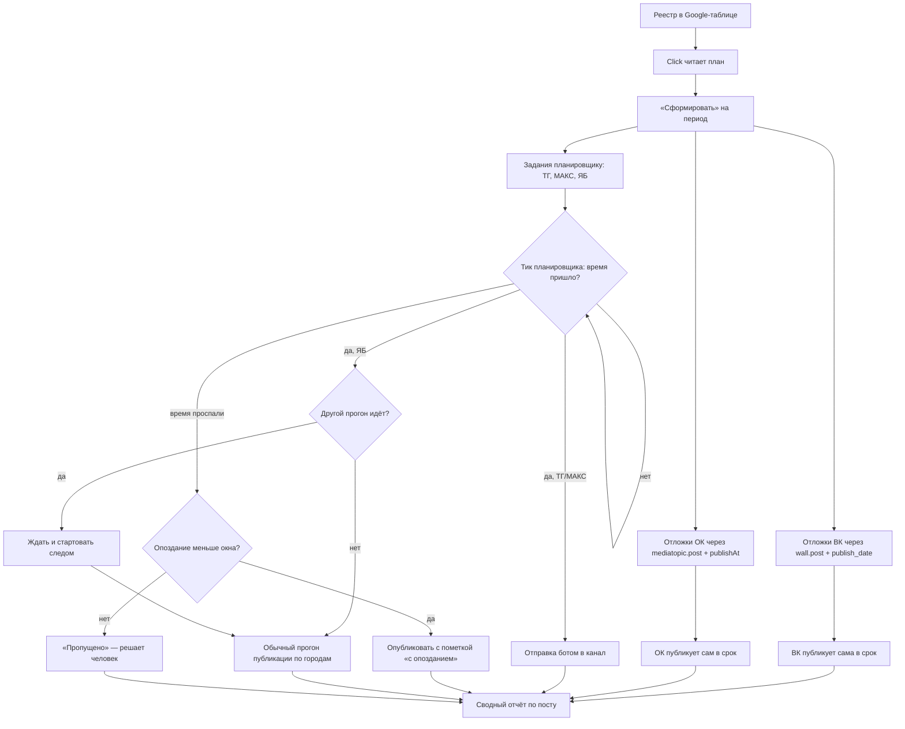
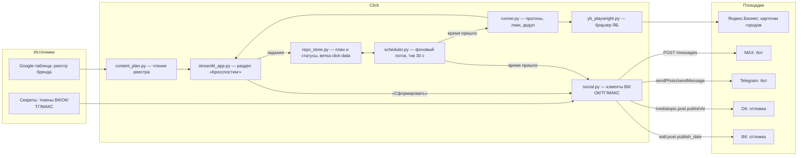
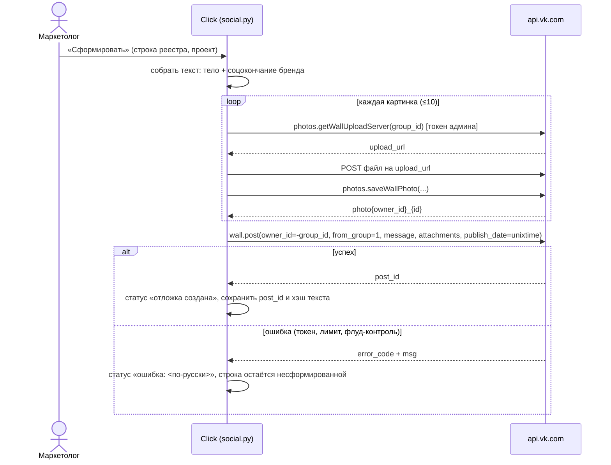
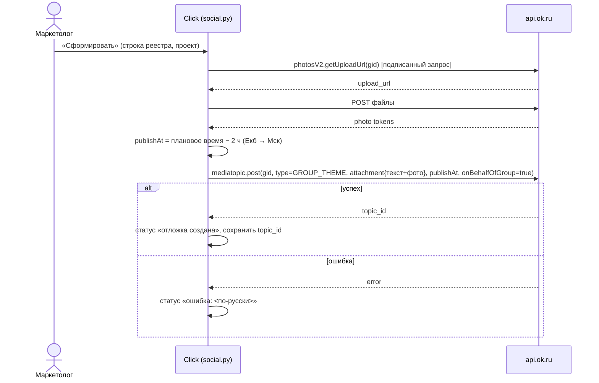
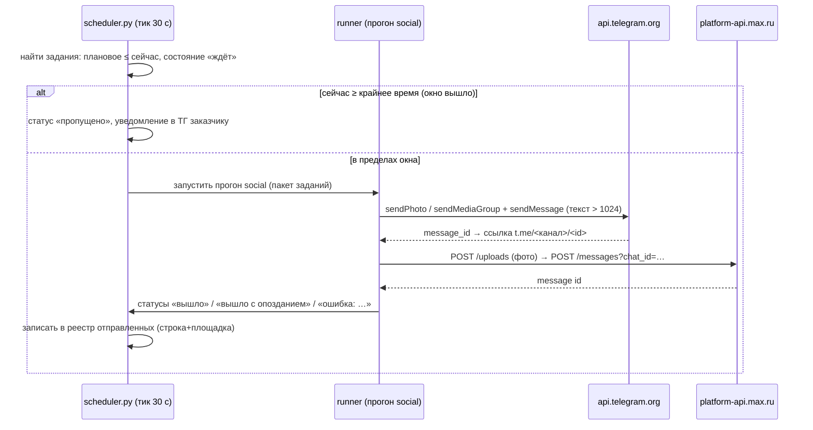
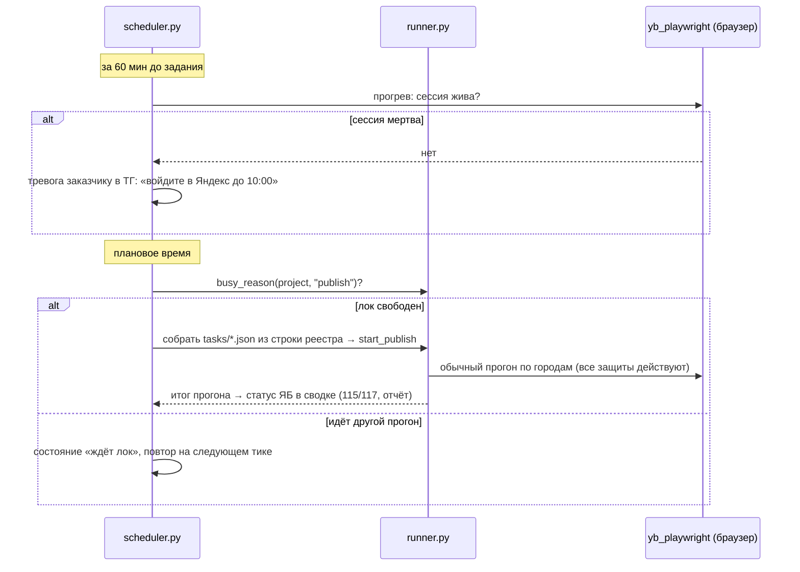

# Постановка: Кросспостинг — посты из реестра в ВК, ОК, Telegram, MAX и Яндекс.Бизнес по расписанию

> Раздел не применим — помечен `N/A` с причиной, не удалён. Нумерация фиксирована для трассировки между разделами документа.
>
> **Редакция 4 (2026-08-07).** Получен реальный реестр СМУ — Q-1 закрыт. Уточнена структура (лист на бренд; пост = блок строк: дата+текст+фото+тип, затем строки по соцсетям с колонкой «Ссылка»); переписан метод 7.3 «Чтение реестра», допущения 5.3. Важные факты из файла: у Телеграма два канала на бренд; МАКС уже активно используется (50 постов); ЯБ в соцреестре нет — отдельная дорожка; колонка «Ссылка» = встроенное место для write-back (снимает Q-7 для соцсетей). Новые вопросы: время публикации (Q-1а), формат картинок (Q-1б).
>
> **Редакция 3 (2026-08-07).** Исправлен факт по МАКС: у него **есть** родной отложенный постинг в приложении (проверено по источникам и доке `POST /messages` — параметров расписания у бота нет). МАКС переклассифицирован в случай Телеграма (родная отложка достижима только сессией, не ботом), но с оговоркой про молодую площадку без библиотеки сессии. Обновлены 2.2, капабилити-таблица в 4, В6; добавлен Q-11 (бот/сессия для МАКС). Итог «Click можно выключать» — потенциально 4 из 5 площадок, жёстко привязан только ЯБ.
>
> **Редакция 2 (2026-08-07).** Добавлены два разбора по вопросам заказчика: (1) стоимость — публикация бесплатна на всех пяти площадках (2.2, «Стоимость доступа»); (2) идея «войти и запомнить сессию, как в ЯБ/2ГИС» — разобрана как альтернатива В6 (браузер) и В3 (сессия Телеграма): браузер для соцсетей отклонён (память/хрупкость/блокировки при бесплатном же API), а сессия взята в сильной форме для Телеграма. Решение по Телеграму поднято на старт Э1 (Q-9).
>
> **Редакция 1 (2026-08-07).** Написана до получения реестра СМУ (заказчик обещала приложить «тот, что на СМУ есть» — файл ещё не пришёл). Всё, что зависит от структуры реестра, помечено допущением и продублировано вопросом Q-1. Возможности площадок проверены по документации и живым багрепортам 2026 года — даты проверки указаны в 2.2.

---

## 0. Шапка

| Поле | Значение |
|---|---|
| **Jira** | N/A — проект Autopilot вне корпоративного трекера, отдельного тикета нет |
| **Vision / BRD** | N/A — основа постановки: сообщение заказчика в Telegram (2026-08-07), код Click, документация API площадок |
| **Описание** | Click учится публиковать посты из контент-плана (реестра) не только в Яндекс.Бизнес, но и в ВК, Одноклассники, Telegram и MAX — и делать это по расписанию: соцсети через их родную отложку, ЯБ и мессенджеры через собственный планировщик |
| **Зависимости** | Проект Click (публикация в ЯБ и 2ГИС работает). Внешние: API ВК, API ОК, Telegram Bot API, MAX Bot API, Google Sheets (реестр) |
| **Заказчик** | Маркетинг-партнёр Autopilot (ведёт SMM пяти брендов) |
| **Автор постановки** | Vladislav |
| **Дата создания** | 2026-08-07 |
| **Статус документа** | Draft, редакция 1 — ждёт реестр СМУ и ответы на вопросы раздела 12 |

---

## 1. Контекст и бизнес-цель

- **Бизнес-проблема.** Click закрыл самую тяжёлую часть SMM — публикацию одного поста в сотню с лишним карточек Яндекс.Бизнеса. Но публикует он «сейчас и по кнопке»: в день поста человек должен открыть приложение, собрать пост, поставить очередь и нажать «Опубликовать». Соцсети брендов (ВК, ОК, Telegram, MAX) в Click не заведены вовсе — туда тот же пост уходит руками через четыре разных кабинета, либо не уходит совсем. Контент-план при этом уже существует — реестр постов с датами (у СМУ он есть), но исполняет его человек по будильнику.
- **Бизнес-цель.** Пост, записанный строкой в реестре, в назначенный день и час выходит на всех отмеченных площадках сам: в соцсетях — секунда в секунду через их отложенную публикацию, в Яндекс.Бизнесе — прогоном по всем городам. Ручная работа сводится к ведению реестра и одному нажатию «Сформировать» раз в неделю.
- **Метрика успеха (KPI)** — черновая, цифры не согласованы: (а) доля постов реестра, вышедших вовремя (соцсети ±5 минут, ЯБ — прогон стартовал в пределах ±10 минут от плана); (б) ручное время на один пост — с ~30–60 минут (пять площадок руками) до ~0 в день публикации.
- **Срок / приоритет:** не зафиксирован. Считать SHOULD, если заказчик не скажет иначе. Внутри задачи есть своя очерёдность площадок — см. план выкатки (раздел 8) и Q-2.

---

## 2. Ключевые источники информации

### 2.1. Глоссарий

| Термин | Определение |
|---|---|
| Реестр | Контент-план: таблица постов с датой, временем, текстом, картинками и списком площадок. Единственный источник правды о том, что и когда выходит |
| Площадка | Одно из пяти мест публикации: ВК, ОК, Telegram, MAX, Яндекс.Бизнес |
| Сообщество | Точка публикации бренда на площадке: группа ВК, группа ОК, канал Telegram, канал MAX. У ЯБ вместо одного сообщества — карточки по городам |
| Нативная отложка | Отложенная запись средствами самой площадки: пост уже лежит у неё и выйдет в срок, даже если Click выключен |
| Планировщик | Новый фоновый механизм Click, который в назначенное время сам отправляет пост туда, где нативной отложки нет |
| Формирование | Действие «взять строки реестра и превратить их в отложки и задания»: ВК/ОК — создать нативные отложки, ТГ/МАКС/ЯБ — поставить задания планировщику |
| Задание | Единица работы планировщика: «в такое-то время отправить такой-то пост на такую-то площадку» |
| Окно опоздания | Сколько часов после планового времени пост ещё имеет смысл публиковать, если Click был выключен. Позже — только руками |
| Прогон | Существующее понятие Click: фоновый процесс по списку городов со своим локом, логом и отчётом |

### 2.2. Источники

- **Сообщение заказчика** (Telegram, 2026-08-07): кросспостинг в «вк, ок, тг, макс и яб» по реестру; в соцсети — «через отложку»; в идеале ЯБ тоже «формировать и отправлять по времени».
- **Реестр СМУ** — ⏳ обещан, не получен. До его получения структура импорта — допущение (5.3) и вопрос Q-1.
- **Репозиторий Click** (прочитан по коду): `streamlit_app.py` (очередь, `save_queue_to_tasks`), `runner.py` (виды прогонов, локи, `CONFLICTS`, реестр отправленных), `yb_playwright.py`, `projects_data.py` (типы постов, окончания, контакты по странам), `kp_sheet.py` (чтение Google-таблиц сервисным аккаунтом), `repo_store.py` (данные, переживающие перезапуск, — ветка `click-data`), `secrets_local.py` (ключи из «Настроек»), `apptime.py` (всё время — по Екатеринбургу, UTC+5).
- **Возможности площадок** — проверены 2026-08-07:
  - **ВК:** [`wall.post`](https://dev.vk.com/ru/method/wall.post) принимает `publish_date` (unixtime) — это и есть отложенная запись сообщества. Загрузка фото к посту (`photos.getWallUploadServer` → `photos.saveWallPhoto`) с ключом сообщества **не работает** — отдаёт ошибку 27, подтверждено живым багрепортом [VKCOM/vk-api-schema#242](https://github.com/VKCOM/vk-api-schema/issues/242) (актуален на апрель 2026). Нужен пользовательский токен админа сообществ.
  - **ОК:** [`mediatopic.post`](https://apiok.ru/dev/methods/rest/mediatopic/mediatopic.post) принимает `publishAt` (строка `yyyy-MM-dd HH:mm:ss`, **зона Europe/Moscow**) либо `publishAtMs` (миллисекунды) — нативная отложка есть. Публикация от имени группы — `onBehalfOfGroup=true`.
  - **Telegram:** [Bot API](https://core.telegram.org/bots/api) отложенной отправки **не имеет** — бот шлёт только «сейчас». Нативные отложенные сообщения существуют лишь в пользовательском API (MTProto, `schedule_date`) — это уже не бот, а сессия человека. Лимиты бота: подпись к фото ≤ 1024 знаков, текстовое сообщение ≤ 4096, альбом 2–10 фото.
  - **MAX:** **родной отложенный постинг в приложении ЕСТЬ** — зажать отправку → «Запланировать пост» → дата/время, дальше МАКС публикует сам, приложение можно закрыть ([smmplanner](https://smmplanner.com/blog/otlozhiennyi-postingh-v-max-kak-podkliuchit-i-nastroit/), [cossa](https://www.cossa.ru/instahero/347035/), [HSE Daily](https://daily.hse.ru/post/avtoram-kanalov-v-max-stal-dostupen-otlozennyi-posting), проверено 2026-08-07). **Но бот к ней доступа не даёт:** у метода `POST /messages` ([dev.max.ru](https://dev.max.ru/docs-api/methods/POST/messages)) параметров расписания нет вовсе (только `text`, `attachments`, `chat_id`, `format`, `notify`) — бот шлёт лишь «сейчас». Значит МАКС повторяет случай Телеграма: родная отложка достижима только пользовательской сессией, а не ботом. Отличие — у МАКС нет зрелой библиотеки сессии (площадка молодая), поэтому его отложку пришлось бы ставить автоматизацией веб-версии (браузер + сохранённая сессия) — самый хрупкий путь. Bot API: `platform-api.max.ru`, токен у @MasterBot, ~30 запросов/с, бот — админ канала.
  - **Яндекс.Бизнес:** публичного API публикаций **нет** (потому Click и водит браузер), отложенной публикации в кабинете нет. Ничего не изменилось.
  - **Streamlit Community Cloud** (где живёт облачная копия Click): приложение без посетителей засыпает, будится только живым заходом браузером — по расписанию на него полагаться нельзя.
- **Стоимость доступа — вопрос заказчика (2026-08-07): нужно бесплатно.** Проверено: публикация в свои сообщества бесплатна на всех пяти площадках. ВК (`wall.post`, загрузка фото), ОК (`mediatopic.post`), Telegram Bot API, MAX Bot API — денег за постинг в свою группу/канал не берут; у ЯБ API нет вовсе, там браузер (тоже бесплатно). Платными у площадок бывают реклама и продвижение — в этой задаче не используются. Вывод: **платить не за что, ни на старте, ни в эксплуатации** (единственная возможная статья расходов — не API, а VPS ради круглосуточного Click, и та опциональна — см. 7.0-В4 и Q-6).

### 2.3. Заинтересованные стороны

| Сторона | Роль | Требования / интересы |
|---|---|---|
| Маркетинг-партнёр Autopilot | Заказчик, ежедневный пользователь | Ведёт один реестр вместо пяти кабинетов; посты выходят в срок сами; видно, что вышло, а что нет и почему |
| Vladislav | Разработчик (весь стек) | Ложится в архитектуру Click (прогоны, локи, repo_store), не ломает публикацию в ЯБ, не тянет второй тяжёлый браузер |
| Пять брендов (СМУ, ИМП, МПЭ, МПИ, АПС) | Бенефициары | Регулярный контент на всех площадках под правильным именем — пост одного бренда не должен уйти в сообщество другого |

---

## 3. Текущее состояние (As-Is)

Что Click умеет сегодня:

- **Публикация в ЯБ** — пакетно по городам, с окончаниями и контактами по странам, защитой от дублей и честным отчётом. Но только **немедленно**: очередь собирается руками во вкладке «Публикация», прогон стартует кнопкой на «Запуске».
- **2ГИС** — актуализация, отзывы, фото отгрузки вслед за постом.
- **Google-таблицы** Click уже читает (города из КП, `kp_sheet.py`), данные между перезапусками хранит в репозитории (`repo_store.py`), время людям показывает по Екатеринбургу (`apptime.py`).

Чего нет совсем:

- **Соцсетей.** Ни ВК, ни ОК, ни Telegram, ни MAX в коде не упоминаются — ни клиентов API, ни токенов, ни полей настроек.
- **Расписания.** В приложении ничто не запускается по времени: все прогоны стартуют человеком. Единственная «автоматика по времени» — перечитывание городов из КП раз в 6 часов, и та срабатывает только при открытии проекта человеком.
- **Реестра.** Контент-план живёт в таблице у заказчика; Click про него не знает.

**Сценарий As-Is** (день, на который в реестре стоит пост):

1. Человек смотрит в реестр, находит сегодняшний пост.
2. Открывает Click → «Публикация»: тип поста, текст, картинки, страны и города → очередь → задачи.
3. «Запуск» → «Опубликовать», ждёт прогон по ЯБ (десятки минут), проверяет отчёт.
4. Открывает кабинет ВК → создаёт пост руками (или отложку руками). Повторяет для ОК, Telegram, MAX — четыре кабинета, четыре раза загрузить те же картинки.
5. Отмечает в реестре, что пост вышел. Если день выходной или человек занят — какая-то из площадок молча пропускается.

**Известные ограничения:**

- Пять площадок = пять ручных публикаций одного и того же контента; время и внимательность человека — единственная гарантия.
- «По времени» не существует: пост выходит, когда у человека дошли руки.
- Пропуски и расхождения между площадками никто не видит: сводного отчёта нет.

**Диаграмма процесса (Mermaid — вместо BPMN/Miro: команда из 2 человек не использует для этого проекта отдельный BPMN-тулинг, прецедент — ПОСТАНОВКА-Отзывы.md):**



---

## 4. Целевое состояние (To-Be)

Стержень решения — одно правило, из которого следует всё остальное:

> **Нативная отложка — везде, где площадка её умеет. Свой планировщик — только там, где без него никак.**

Что умеет каждая площадка (проверено, см. 2.2):

| Площадка | API публикации | Нативная отложка | Кто отвечает за «выйти вовремя» | Особенности |
|---|---|---|---|---|
| **ВК** | ✅ `wall.post` | ✅ `publish_date` | **сама ВК** — Click может быть выключен | фото грузятся только пользовательским токеном админа; до 10 вложений; потолок ВК на отложенные (~150 на сообщество) при недельном горизонте не мешает |
| **ОК** | ✅ `mediatopic.post` | ✅ `publishAt` | **сам ОК** — Click может быть выключен | `publishAt` в московском времени → из Екатеринбурга минус 2 часа, конвертирует код, не человек |
| **Telegram** | ✅ Bot API; ✅ сессия (MTProto) | ботом ❌; сессией ✅ (родная отложка) | ботом — планировщик Click; **сессией — сам Телеграм** | выбор бот/сессия — Q-9. Подпись к фото ≤ 1024 знаков: длинный пост уходит альбомом + текстом отдельным сообщением |
| **MAX** | ✅ Bot API; сессия — только браузером | в приложении ✅ есть, ботом ❌ | ботом — планировщик Click; **сессией — сам МАКС** | выбор бот/сессия — Q-11. Родная отложка есть, но бот к ней доступа не даёт; сессия — через веб (хрупко, площадка молодая) |
| **Яндекс.Бизнес** | ❌ только браузер | ❌ нигде нет | **планировщик Click** | единственная площадка без родной отложки; прогон по городам — десятки минут, старт планируется, а не «мгновенный выход» |

Из правила и таблицы вырастает целевой процесс. В Click появляется раздел **«🗓 Кросспостинг»**:

1. **Реестр подключается как источник** — ссылка на Google-таблицу бренда (тот же механизм, что у КП: сервисный аккаунт-читатель). Click читает строки: дата, время, тип поста, текст, картинки, отметки площадок. Раздел показывает план на неделю-две вперёд: что, когда, куда, что уже сформировано, что вышло.
2. **«Сформировать»** — одно действие на пачку строк:
   - **ВК и ОК**: Click сразу создаёт нативные отложки через API (грузит фото, ставит время). С этой секунды посты живут в самих соцсетях и выйдут в срок **независимо от Click**. Их видно в кабинетах площадок — можно поправить руками, и это штатно.
   - **Telegram, MAX, ЯБ**: Click ставит задания собственному планировщику.
3. **Планировщик** — фоновый поток, тикает раз в 30 секунд: наступило время задания → Telegram и MAX получают пост через ботов (лёгкие HTTP-вызовы, без браузера), для ЯБ собирается очередь задач и стартует обычный прогон публикации — тот же, что сегодня по кнопке, со всеми его защитами. Если в этот момент идёт другой прогон — задание ждёт и стартует следом (лок никто не отменял).
4. **Опоздание — явление, а не сюрприз.** Click был выключен в назначенный час → при следующем запуске планировщик находит просроченные задания: опоздание меньше окна (настройка, по умолчанию 6 часов) — публикует с пометкой «с опозданием»; больше — помечает «пропущено», пусть решает человек. Молча публиковать утренний пост в полночь нельзя.
5. **Сводный отчёт** — одна строка на пост: `ВК ✅ (ссылка) · ОК ✅ · ТГ ✅ · МАКС ❌ токен · ЯБ 115/117 (отчёт)`. Не «кажется, вышло», а знание.

**Ключевые отличия от As-Is:** реестр из памятки для человека становится исполняемым планом; пять кабинетов заменяются одним «Сформировать»; время выхода перестаёт зависеть от будильника; появляется сводная правда о том, что вышло.

**Сценарий To-Be** (обычная неделя):

1. Заказчик ведёт реестр как привыкла: строки с датами, текстами, картинками, отметками площадок.
2. Раз в неделю (или чаще) открывает Click → «Кросспостинг». Раздел показывает свежие строки реестра. Жмёт «Сформировать» на выбранный период.
3. Click создаёт отложки ВК и ОК (фото, текст, время), ставит задания ТГ/МАКС/ЯБ, показывает итог: «5 постов × 5 площадок: 10 отложек создано, 15 заданий поставлено».
4. В назначенные моменты: ВК и ОК публикуют сами; планировщик Click отправляет посты в ТГ и МАКС и запускает прогон ЯБ.
5. Заказчик заглядывает в раздел: сводная строка по каждому посту, у ЯБ — привычный подробный отчёт по городам. Пропуски и ошибки видны сразу, с причиной словами.

**Альтернативный путь — Click был выключен в момент поста (ТГ/МАКС/ЯБ):**
- При включении планировщик разбирает просроченное по правилу окна: «с опозданием» либо «пропущено». Отложек ВК/ОК это не касается — они вышли сами.

**Альтернативный путь — к моменту прогона ЯБ сессия Яндекса умерла:**
- За настраиваемое время до задания (по умолчанию 60 минут) планировщик прогревает сессию лёгкой проверкой; если сессия мертва — тревога заказчику (уведомление ботом в личный ТГ, раз бот всё равно появляется), чтобы был шанс перелогиниться до часа Х. Сам прогон при мёртвой сессии останавливается на первом городе с честным статусом — как сегодня.

**Альтернативный путь — строку реестра поправили после формирования:**
- Click хранит хэш текста на момент формирования. При следующем открытии раздела расхождение подсвечивается: «в реестре текст изменился после формирования» → кнопка «Переформировать» (ВК — `wall.edit` отложенной записи, ОК — пересоздание отложки, задания планировщика — просто обновляются).

**Диаграмма целевого процесса (Mermaid):**



---

## 5. Scope

### 5.1. Входит

- [ ] Раздел «Кросспостинг»: план из реестра, «Сформировать», сводные статусы
- [ ] Чтение реестра из Google-таблицы (по образцу КП; формат — после получения реестра СМУ, Q-1)
- [ ] ВК: создание отложенных записей с фото через API, хранение ID отложки, «Переформировать»
- [ ] ОК: то же через `mediatopic.post` / `publishAt` (конвертация времени в московское — в коде)
- [ ] Telegram: бот, публикация в каналы брендов в назначенное время
- [ ] MAX: бот, публикация в каналы брендов в назначенное время
- [ ] ЯБ: запуск существующего прогона публикации по времени, с очередью при занятости и окном опоздания
- [ ] Планировщик: фоновый поток, задания в файлах + зеркало в repo_store, правило опоздания, защита от дублей
- [ ] Сборка текста под площадку: тело из реестра + окончание (ЯБ — как сегодня по странам; соцсети — своё окончание бренда, редактируется в «Настройках»)
- [ ] Настройки: токены и ID сообществ по брендам, проверка «токен жив» кнопкой
- [ ] Уведомления о сбоях ботом в личный Telegram заказчика
- [ ] Тесты: сборка текстов (golden), конвертация времени, окно опоздания, дедуп, e2e с заглушками API

### 5.2. НЕ входит (out of scope)

> Явно фиксируем, что не делаем — иначе разрастётся.

- **Генерация контента** — тексты и картинки рождаются в реестре человеком; LLM в этой задаче не участвует
- **Другие площадки** (Дзен, Rutube, Пинтерест и т.п.) — не просили; архитектура оставляет место (площадка = модуль), но в задачу не входит
- **Ответы на комментарии в соцсетях** — отдельная тема, по образцу отзывов ЯБ, если понадобится
- **Аналитика охватов/просмотров** — Click отвечает «вышло/не вышло», не «как сработало»
- **Городские сообщества в соцсетях** — считаем одно сообщество на бренд на площадку (допущение 5.3, Q-2); если у брендов есть сети городских групп — это другая задача другого масштаба
- **Запись статусов обратно в Google-реестр** — вынесено в этап Э4 как опция (нужны права Редактора сервисному аккаунту, Q-7); до тех пор правда живёт в разделе «Кросспостинг»
- **Нативная отложка Telegram через пользовательскую сессию (MTProto)** — осознанно отложено (см. 7.0-В3): начинаем с бота, MTProto добавим, только если жизнь покажет, что нужна независимость от работающего Click и для ТГ

### 5.3. Допущения

- **Структура реестра ИЗВЕСТНА** (файл получен 2026-08-07, Q-1 закрыт): лист на бренд (СМУ, ИМП, МПЭ, АПС), пост = блок строк; см. 7.3 «Чтение реестра».
- У Телеграма **два канала** на бренд (`сотрудники` и `клиент`) — «Телеграм» = две цели, не одна. У ВК/ОК/МАКС — по одной. Дзен в реестре есть, но вне scope (5.2).
- **ЯБ в этом реестре нет** — соцлист отдельный от ЯБ; у ЯБ свой поток (существующая публикация Click) и свой лист «Реестр новостей ЯБ». Значит «Запланировать посты» по соцлисту ЯБ не трогает вовсе; ЯБ по времени (Q-8) — отдельная надстройка над этим же механизмом.
- Тексты в реестре готовые; тело общее на все сети даты (иногда у сети своя подпись). Соцокончание бренда добавляется поверх. Q-4
- Картинки — ссылками (`https://i.ibb.co/...`), одна на пост, общая для сетей. Скачиваются один раз, льются во все.
- Колонка «Ссылка» блока = адрес опубликованного поста; у будущих постов пуста → это и есть «что ещё не сформировано», и туда же Click пишет ссылку после выхода (write-back, снимает Q-7 для соцсетей).
- Все сообщества ВК администрирует один аккаунт → один пользовательский токен; боты/сессии ТГ и МАКС — по одному на бренд, каналы разные.

### 5.4. Ограничения

- **ЯБ без API** — только браузер, значит по времени запускается именно прогон, со всеми его свойствами: длится десятки минут, не живёт рядом со вторым тяжёлым браузером (`CONFLICTS`), требует живой сессии Яндекса
- **Планировщик работает, пока работает Click.** Облако (Streamlit Cloud) засыпает без посетителей — на расписание там полагаться нельзя. Для ТГ/МАКС/ЯБ по времени нужен постоянно включённый хозяин: локальный ПК, который не выключают, или маленький VPS (см. 7.0-В4 и Q-6). Отложек ВК/ОК это ограничение не касается — потому они и формируются нативно
- **Фото в ВК** — только пользовательским токеном админа (ограничение ВК, 2.2)
- **`publishAt` ОК — московское время**, вечный источник ошибок на ±2 часа — конвертация зашивается в код и накрывается тестом
- **Подпись к фото в ТГ ≤ 1024 знаков** — правило разбиения длинного поста фиксируется в коде (7.3), а не решается каждый раз
- Секреты хранятся как сегодня (переменная → секреты Streamlit → «Настройки»), в репозиторий не попадают

---

## 6. Требования

Иерархия БТ → ПТ → ФТ → НФТ. Одна строка = одна сквозная цепочка; ID стабильные, на них ссылаются тест-кейсы (раздел 10) и приёмка (раздел 11).

| # | Бизнес-требование (БТ) | Пользовательское требование (ПТ) | Функциональное требование (ФТ) | Нефункциональное требование (НФТ) |
|---|---|---|---|---|
| 1 | **БТ-1.** Посты из реестра выходят на всех отмеченных площадках в назначенное время без ручной публикации | **ПТ-1.** Я, как маркетолог, хочу подключить свой реестр и видеть в Click план публикаций | **ФТ-1.** КОГДА задана ссылка на таблицу реестра, система ДОЛЖНА прочитать строки (дата, время, тип, текст, картинки, площадки) и показать план с пометками «не сформировано / сформировано / вышло / ошибка» | **НФТ-1.** Чтение и показ реестра на 100 строк ≤ 30 с |
| 2 | | **ПТ-2.** Я хочу одним действием превратить строки реестра в отложки и задания | **ФТ-2.** КОГДА нажато «Сформировать», система ДОЛЖНА создать отложенные записи ВК (`wall.post` + `publish_date`) и ОК (`mediatopic.post` + `publishAt`, время конвертировано в московское) с текстом и картинками и сохранить ID созданных отложек | **НФТ-2.** Формирование одного поста с 4 фото ≤ 60 с на площадку; повторное нажатие не создаёт дублей (идемпотентность по строке реестра) |
| 3 | | | **ФТ-3.** КОГДА нажато «Сформировать», система ДОЛЖНА поставить задания планировщику для ТГ, МАКС и ЯБ с временем из реестра | **НФТ-3.** Задания переживают перезапуск приложения (файлы + repo_store) |
| 4 | | **ПТ-3.** Я хочу, чтобы ТГ и МАКС получали пост в назначенную минуту | **ФТ-4.** КОГДА наступает время задания и приложение работает, система ДОЛЖНА отправить пост ботом в канал ТГ и канал МАКС бренда | **НФТ-4.** Задержка отправки при работающем приложении ≤ 60 с от планового времени |
| 5 | | **ПТ-4.** Я хочу, чтобы прогон ЯБ стартовал по расписанию сам | **ФТ-5.** КОГДА наступает время задания ЯБ, система ДОЛЖНА собрать очередь задач по городам строки реестра и запустить прогон публикации; КОГДА идёт конфликтующий прогон — дождаться его конца и стартовать следом | **НФТ-5.** Прогон стартует ≤ 10 мин от планового времени при свободном локе; вторая тяжёлая сессия браузера не поднимается никогда |
| 6 | | **ПТ-5.** Я хочу, чтобы выключенный вовремя компьютер не превращался в молчаливый пропуск | **ФТ-6.** КОГДА при старте приложения находятся просроченные задания, система ДОЛЖНА выполнить те, что опоздали меньше окна (настройка, умолчание 6 ч), с пометкой «с опозданием», а остальные пометить «пропущено» и НЕ публиковать | **НФТ-6.** Окно опоздания настраивается в «Настройках», 0–24 ч |
| 7 | | | **ФТ-7.** КОГДА задание уже выполнено (реестр отправленных: строка реестра + площадка), система НЕ ДОЛЖНА публиковать его повторно — в том числе после перезапуска и при повторном «Сформировать» | **НФТ-7.** Защита действует те же 12 ч (настройка), что у дублей ЯБ сегодня |
| 8 | **БТ-2.** Заказчик видит правду о том, что вышло | **ПТ-6.** Я хочу видеть по каждому посту статус на каждой площадке | **ФТ-8.** КОГДА публикация на площадке завершилась или сорвалась, система ДОЛЖНА показать в сводке статус и причину словами, со ссылкой на пост там, где площадка её отдаёт (ВК, ОК, ТГ) и на отчёт прогона у ЯБ | **НФТ-8.** Сводка обновляется при каждом открытии раздела; история — 90 дней |
| 9 | | **ПТ-7.** Я хочу узнавать о проблемах до часа Х, а не после | **ФТ-9.** КОГДА токен площадки не работает — при формировании; КОГДА сессия ЯБ мертва — при прогреве до задания; система ДОЛЖНА сказать об этом сразу (в разделе и уведомлением в личный ТГ) | **НФТ-9.** Прогрев сессии ЯБ — за 60 мин до задания (настройка) |
| 10 | **БТ-3.** Пост одного бренда никогда не уходит в сообщество другого | N/A — системная гарантия | **ФТ-10.** КОГДА формируется отложка или задание, система ДОЛЖНА брать ID сообщества строго из настроек проекта строки реестра; смешение проектов в одном формировании запрещено | **НФТ-10.** ID сообществ хранятся по проектам в projects-config.json, как email Яндекса сегодня |

**Правила формулировки** — по шаблону: «ДОЛЖНА» = MUST, без «и/или» в одном ФТ, НФТ с числами.

### 6.1. Требования сопровождения

- README: новый раздел «Кросспостинг» с «Если что-то не так» (по образцу отзывов)
- ВЕРСИИ.md: запись на каждый этап выкатки
- Уведомления заказчику — ботом в личный ТГ (алертинг-инфраструктуры нет и не нужно: бот уже есть по задаче)
- Регулярные операции: контроль срока жизни токенов (ОК — особенно, см. R-4), чистка выполненных заданий старше 90 дней
- SLA/RTO/RPO — N/A: не тот масштаб; целевые времена зашиты в НФТ-4/5/6

---

## 7. Дизайн решения

### 7.0. Рассмотренные альтернативы

Честный разбор «а зачем строить», прежде чем строить.

- **В1. Готовый SMM-сервис** (SMMplanner, Postmypost, NovaPress и т.п.) — умеют ВК/ОК/ТГ по расписанию из календаря. Отклонено как основной путь: (а) **Яндекс.Бизнес по 117–144 карточкам не умеет ни один** — уникальная ценность Click остаётся на нас в любом случае; (б) пять брендов × площадки = платный тариф навсегда; (в) реестр пришлось бы вести в чужом календаре или синхронизировать — два места правды. Итог: соцсети через их API — тонкий слой (сотни строк), который дешевле встроить рядом с уже существующей тяжёлой частью.
- **В2. Всё через свой планировщик, без нативных отложек** (единообразно: Click сам шлёт и в ВК, и в ОК в момент времени). Отклонено: выключенный компьютер убивал бы и те публикации, которые площадки готовы сделать сами. Нативная отложка — бесплатная надёжность, глупо не взять.
- **В3. Нативная отложка и для Telegram — через сохранённую пользовательскую сессию (MTProto)** (`schedule_date`: отложенные посты Телеграм держит сам, видны прямо в канале и выходят без Click). Это ровно идея заказчика «войти, как в ЯБ/2ГИС, и запомнить сессию», применённая к Телеграму: один раз вход по номеру телефона и коду → сессия сохраняется (файл, как сессия Яндекса) → дальше ставим родные отложенные сообщения. **Из всех площадок это единственная, где идея сессии реально что-то добавляет** — ВК и ОК свою отложку и так дают через бесплатное API (В6), а МАКС/ЯБ сессия не спасает. Плюсы: Телеграм-посты выходят при выключенном Click. Минусы: тянет отдельный стек (Telethon/Pyrogram) и доверенную сессию живого аккаунта. **Решение — на старте Э1** (а не «после», как в ред. 1): если заказчику важно, чтобы ТГ не зависел от включённой машины, — сразу сессия; иначе простой бот, а сессию добавим позже (Q-9). Обе ветки укладываются в один интерфейс площадки (7.3), выбор — флажком в «Настройках».
- **В6. Браузерная автоматизация соцсетей с сохранённой сессией** (прямой ответ на вопрос заказчика: «а нельзя ли для всех, как ЯБ/2ГИС, — войти, запомнить сессию и кликать по кабинету?»). Технически да, и у идеи есть настоящий плюс: отложку ВК/ОК/ТГ можно ставить через их же сайт, и тогда пост держит площадка (Click можно выключать). Отклонено как основной путь по трём причинам, все — из практики самого Click: **(1) память** — весь проект построен вокруг того, что бесплатное облако не тянет два тяжёлых браузера (`CONFLICTS`, `MAX_PARALLEL_RUNS`), а тут добавилось бы до четырёх; API же — лёгкие HTTP-вызовы; **(2) хрупкость** — селекторы ломаются на каждом редизайне (этим полны `PLAN.md`/`REVIEW.md` по одному Яндексу), умножить на четыре площадки; **(3) блокировки** — бизнес-кабинеты (ЯБ, 2ГИС) к автоматизации терпимы, а основной ВК/ОК агрессивно ловят ботов (капча, «подозрительный вход»), риск — блокировка ГЛАВНОГО аккаунта бренда. Решающий довод: раз API **бесплатно** (2.2) и для ВК/ОК **само даёт ту самую отложку**, браузер здесь — не выигрыш, а чистый проигрыш (та же отложка, но хрупко и прожорливо). Поэтому для ВК/ОК браузер не нужен никогда. Где он остаётся уместен: **обязательно — ЯБ** (API нет вовсе); **опционально — МАКС** (родная отложка есть, но бот к ней не пускает, а библиотеки сессии у молодой площадки нет — единственный путь к «МАКС держит пост сам» лежит через автоматизацию веб-версии; решение — Q-11). А идею сохранённой сессии в чистом, небраузерном виде берём для Телеграма (В3).
- **В4. Где живёт планировщик.** (а) **Локальный ПК, который не выключают** — то, что есть сегодня; ноль затрат, риск «выключили — проспали» гасится окном опоздания и тем, что ВК/ОК выходят сами. (б) **Маленький VPS** (~300–500 ₽/мес): Click работает круглосуточно, сессии живут постоянно — правильный дом для расписания, рекомендуемая цель (Q-6). (в) **Streamlit Cloud** — остаётся для ручной работы из любой точки, но для расписания непригоден: засыпает (2.2). (г) **GitHub Actions по крону** — бесплатный будильник для ТГ/МАКС (чистый API), но ЯБ оттуда потребовал бы возить сессию Яндекса в репозиторий — небезопасно и хрупко; отклонено, чтобы не плодить второй исполнитель рядом с планировщиком.
- **В5. Отложка ЯБ «руками заранее»** — в кабинете ЯБ отложенной публикации просто нет (2.2), альтернатива не существует. Только планировщик.

### 7.1. Архитектура

**Схема (Mermaid — вместо Miro, прецедент ПОСТАНОВКА-Отзывы.md):**



**Проектные решения:**

- **Д-1. Гибрид отложек** — правило из раздела 4. Следствие: надёжность выхода ВК/ОК не зависит от Click вообще; критичной по времени остаётся тройка ТГ/МАКС/ЯБ.
- **Д-2. Планировщик — поток в процессе Click, состояние в файлах.** Демон-поток по образцу `playwright_worker`, тик 30 с. Задания лежат в `users-data/crosspost/plan-<PROJECT>.json` и зеркалятся в repo_store (`crosspost-plan-<PROJECT>`) — перезапуск и переезд переживаются. От второй копии приложения — лок-файл, как у прогонов.
- **Д-3. Отправка в соцсети — новый лёгкий вид прогона `social`.** `RUN_KINDS + ("social",)`, `CONFLICTS["social"] = ("social",)`: браузера нет, памяти не ест, уживается с любым прогоном. Получает свой живой лог, отчёт и кнопку «Остановить» бесплатно — вся механика уже написана.
- **Д-4. ЯБ по времени — это существующий `publish`, никакой второй реализации.** Планировщик делает то же, что человек: собирает файлы задач (как `save_queue_to_tasks`) и зовёт `start_publish`. Занято (`busy_reason`) → задание в состоянии «ждёт лок», следующая попытка на каждом тике. Все защиты от дублей действуют без изменений.
- **Д-5. Опоздания.** У задания два времени: плановое и крайнее (плановое + окно). Планировщик на тике: `плановое ≤ сейчас < крайнее` → выполнить с пометкой «с опозданием» (если сейчас > плановое + 60 с); `сейчас ≥ крайнее` → статус «пропущено», уведомление, никакой публикации.
- **Д-6. Идемпотентность формирования.** Ключ поста = стабильный ID строки реестра (дата+время+проект+хэш текста). Отложка создана → её ID (ВК `post_id`, ОК `topic_id`) хранится в статусе; повторное «Сформировать» видит ключ и не создаёт второй отложки. Изменился текст → расхождение хэшей → «Переформировать» осознанным действием.
- **Д-7. Сборка текста по площадкам.** Тело — из реестра. ЯБ: тело + окончание типа поста с контактами страны (существующий механизм, не трогаем). Соцсети: тело + «соцокончание» бренда — единый настраиваемый хвост (сайт, телефон 8-800/российский, хэштеги типа поста), редактор в «Настройках» рядом с окончаниями ЯБ, заводские значения — из российских контактов `projects_data.py`. Лимиты: ТГ — подпись ≤ 1024, иначе альбом без подписи + текст отдельным сообщением (≤ 4096); ВК/ОК/МАКС — посты наших длин проходят целиком.
- **Д-8. Время.** Реестр и весь интерфейс — Екатеринбург (`apptime`). Внутри задания — ISO с поясом, сравнение в UTC. ВК получает unixtime (пояс не важен), ОК — строку в московском времени (конвертация в коде, тест обязателен), ТГ/МАКС/ЯБ исполняются по нашим часам.
- **Д-9. Токены.** `secrets_local.KNOWN` пополняется: `vk_user_token`, `ok_app_key`, `ok_app_secret`, `ok_access_token`, `tg_bot_token`, `max_bot_token`, `tg_alert_chat_id`. ID сообществ (`vk_group_id`, `ok_group_id`, `tg_channel`, `max_chat_id`) — по проектам в `projects-config.json`. Порядок поиска секретов — тот же, что везде.

### 7.2. Затронутые компоненты

| Компонент | Тип изменения | Описание | Репозиторий |
|---|---|---|---|
| `social.py` | **Новый** | Клиенты площадок: ВК (загрузка фото, `wall.post`, `wall.edit`), ОК (`photosV2`, `mediatopic.post`, подпись запросов), ТГ (`sendPhoto`/`sendMediaGroup`/`sendMessage`), МАКС (`/uploads`, `/messages`). Ошибки — словами по-русски | mag66530/Click |
| `scheduler.py` | **Новый** | Демон-поток: тик, состояния заданий, окно опоздания, прогрев сессии ЯБ, лок от второй копии | mag66530/Click |
| `content_plan.py` | **Новый** | Чтение реестра из Google-таблицы (по образцу `kp_sheet.py`), маппинг колонок, стабильные ID строк | mag66530/Click |
| `streamlit_app.py` | Изменение | Раздел «🗓 Кросспостинг»: план, «Сформировать», сводные статусы; поля настроек (токены, ID сообществ, окно опоздания) | mag66530/Click |
| `runner.py` | Изменение | Вид прогона `social` (+`CONFLICTS`), программный запуск `start_publish` от планировщика, расширение ключа реестра отправленных площадкой | mag66530/Click |
| `secrets_local.py` | Изменение | Новые ключи в `KNOWN` | mag66530/Click |
| `projects_data.py` | Изменение | Заводские соцокончания брендов (из российских контактов и хэштегов) | mag66530/Click |
| `tests_click.py`, `tests_runner_e2e.py` | Изменение | Юниты на сборку текстов/время/окно/дедуп; e2e планировщика и `social` с заглушками HTTP | mag66530/Click |
| `README.md`, `ВЕРСИИ.md` | Изменение | Документация и запись о версии | mag66530/Click |

### 7.3. Методы

REST-ручек у Click нет — «методом» здесь считается операция с внешней площадкой или планировщиком. Для каждой: (1) последовательность, (2) сценарий, (3) модель данных, (4) контракт вызовов. Контракты OpenAPI — N/A: API чужие, ссылки на официальную документацию даны в каждом блоке.

---

#### Операция: «Сформировать отложку ВК»

**(1) UML Sequence**



**(2) Сценарий**

1. Текст собирается один раз и фиксируется хэшем — по нему потом ловится правка реестра задним числом.
2. Картинки грузятся пользовательским токеном админа — ограничение ВК (2.2). Токен один на все пять сообществ (допущение 5.3).
3. `publish_date` — unixtime планового времени; ВК публикует сама.
4. Повторное «Сформировать» по строке с сохранённым `post_id` — пропуск, не дубль (Д-6).
5. «Переформировать» после правки текста — `wall.edit(post_id, ...)`; если ВК не даёт править — удалить и создать заново, новый `post_id` в статус.

**Ошибки:** токен протух/отозван → ФТ-9 (сразу видно при формировании); лимит отложенных ВК (~150) на горизонте недели недостижим; сетевые ошибки — до 3 повторов с паузой, дальше статус «ошибка» словами.

**(3) Модель данных** — общий формат задания (ниже, блок «Планировщик»); специфика ВК: `{"vk": {"postId": 123, "textHash": "…", "state": "scheduled"}}`.

**(4) Контракт** — [dev.vk.com/ru/method/wall.post](https://dev.vk.com/ru/method/wall.post), [photos.saveWallPhoto](https://dev.vk.com/ru/method/photos.saveWallPhoto). Авторизация: пользовательский токен админа, scope `wall, photos, groups, offline`, версия API фиксируется в коде. Идемпотентность — на нашей стороне (Д-6): ВК свой ключ идемпотентности не предоставляет.

---

#### Операция: «Сформировать отложку ОК»

**(1) UML Sequence**



**(2) Сценарий**

1. Запросы ОК подписываются по их схеме (MD5 от отсортированных параметров с session-ключом) — прячется в клиенте, наружу не торчит.
2. **Конвертация времени — в коде и только в коде**: `publishAt` строкой в московском времени; Екатеринбург — минус два часа. Ошибка здесь — пост «уехал» на 2 часа, поэтому конвертация накрыта юнит-тестом и проверяется на пилоте живой отложкой (TC-4).
3. Идемпотентность и «Переформировать» — как у ВК (у ОК правка отложенного топика может потребовать пересоздания — уточняется на пилоте).

**(3) Модель данных** — специфика ОК: `{"ok": {"topicId": "…", "textHash": "…", "state": "scheduled"}}`.

**(4) Контракт** — [apiok.ru: mediatopic.post](https://apiok.ru/dev/methods/rest/mediatopic/mediatopic.post) (`publishAt`, `publishAtMs`, `onBehalfOfGroup`). Авторизация: приложение ОК (`application_key` + секрет) + access_token с правами `VALUABLE_ACCESS`, `GROUP_CONTENT`, `PHOTO_CONTENT`. Схема жизни токенов ОК (срок, продление) — проверяется на пилоте, автопродление закладывается в клиент (R-4, Q-3).

---

#### Операция: «Тик планировщика — отправка в Telegram и MAX»

**(1) UML Sequence**



**(2) Сценарий**

1. Тик каждые 30 с; всё сравнение времени в UTC. Планировщик ничего не публикует сам — он ставит лёгкий прогон `social`, у которого есть лог, отчёт и «Остановить».
2. Правило ТГ: текст ≤ 1024 и фото есть → `sendPhoto`/`sendMediaGroup` с подписью; текст длиннее → альбом без подписи + `sendMessage` следом; фото нет → `sendMessage`.
3. МАКС: фото через `/uploads`, сообщение через `/messages`; лимит 30 запросов/с нам не грозит (единицы вызовов). Точная форма вложений сверяется с dev.max.ru на пилоте (площадка молодая, R-5).
4. Успех каждой площадки фиксируется отдельно: ТГ вышел, МАКС упал → в сводке два разных статуса, повторная попытка только для упавшего (реестр отправленных не даст продублировать ТГ).

**(3) Модель данных — задание планировщика (общая для всех площадок):**

```json
{
  "id": "SMU-2026-08-12-1000",
  "project": "SMU",
  "when": "2026-08-12T10:00:00+05:00",
  "deadline": "2026-08-12T16:00:00+05:00",
  "postType": "arrival",
  "text": "…тело из реестра…",
  "images": ["https://…/1.jpg", "https://…/2.jpg"],
  "targets": {
    "vk":  {"state": "scheduled", "postId": 123,  "textHash": "…"},
    "ok":  {"state": "scheduled", "topicId": "…", "textHash": "…"},
    "tg":  {"state": "waiting"},
    "max": {"state": "waiting"},
    "yb":  {"state": "waiting", "cities": "all"}
  }
}
```

Состояния цели: `waiting → running → sent | sent-late | missed | failed(reason)`; у ВК/ОК вместо `waiting` сразу `scheduled` (отложка живёт на площадке). Хранение: `users-data/crosspost/plan-<PROJECT>.json` + зеркало в repo_store; выполненные старше 90 дней вычищаются.

**(4) Контракты** — [core.telegram.org/bots/api](https://core.telegram.org/bots/api) (`sendPhoto`, `sendMediaGroup`, `sendMessage`; бот — админ канала с правом публикации); [dev.max.ru/docs](https://dev.max.ru/docs) (токен у @MasterBot, `POST /uploads`, `POST /messages`; бот — админ канала). Идемпотентность — наш реестр отправленных (ФТ-7).

---

#### Операция: «Запуск прогона ЯБ по времени»

**(1) UML Sequence**



**(2) Сценарий**

1. Планировщик готовит очередь так же, как «Публикация» руками: страны и города проекта, текст, картинки — и вызывает существующий `start_publish`. Ни одной новой строчки браузерного кода.
2. Занятый лок — не ошибка: задание ждёт и стартует следом (НФТ-5). Ожидание видно в разделе: «ждёт окончания актуализации».
3. Прогон длится десятки минут — «время в реестре» для ЯБ означает **старт** прогона. Если заказчику нужно «к 10:00 пост уже стоит везде» — время строки для ЯБ ставится раньше (решение за заказчиком, Q-8).
4. Прогрев за 60 минут — лёгкое открытие кабинета: жива сессия → тихо; мертва → уведомление, чтобы был шанс войти заново до часа Х (ФТ-9).
5. Дальше работают все сегодняшние правила: реестр отправленных, «Проверьте» без повторного клика, честный отчёт по городам.

**(3) Модель данных** — цель `yb` в задании (выше); города: `"all"` (все города проекта) или явный список стран — формат уточняется вместе с реестром (Q-1).

**(4) Контракт** — внутренний: `runner.start_publish(project_id)` + файлы задач формата `save_queue_to_tasks` (`streamlit_app.py:707`). Внешнего API нет — в этом и суть.

---

#### Операция: «Чтение реестра»

**(1) UML Sequence** — тривиальная (Google Sheets API → строки → план), диаграмма опущена сознательно.

**Реальная структура (файл заказчика, 2026-08-07).** Лист на бренд (`СМУ`, `ИМП`, `МПЭ`, `АПС`). Пост — **блок строк**: заголовки в строке 1 (`Когда выложить` B, `Соцсеть` C, `Бренд` D, `Ссылка` E, `Формат` F, `Тип` G, `Пост` H, `Фото` I), справа отдельный блок статистики (колонки J+, при разборе игнорируется). Первая строка блока несёт дату (B), текст (H), фото-ссылку (I), тип (G); следующие строки блока — по одной на **соцсеть** (C), у каждой своя `Ссылка` (E) на опубликованный пост. Соцсети в СМУ: `Telegram (сотрудники)`, `Telegram (клиент)`, `Одноклассники`, `Вконтакте`, `Max (клиент)`, изредка `Дзен` (вне scope). Даты в файле — с 2025-06 по 2026-08; у будущих постов колонка E пуста.

**(2) Сценарий**

1. Ссылка на таблицу реестра задаётся в «Кросспостинге» на проект (хранится в projects-config.json), доступ — тот же сервисный аккаунт-читатель, что у КП.
2. Лист бренда разбирается по блокам: дата (B, только первая строка блока) → текст (H), фото (I), тип (G) → набор целей из строк `Соцсеть` (C) под датой. Правый статистический блок (J+) и строки без даты в начале блока игнорируются. `Формат=Видео/Статья` (F) — пока пропускаем с пометкой (scope — «Пост»).
3. Берутся блоки, где дата ≥ сегодня и `Ссылка` (E) по цели пуста, — это и есть «не сформировано». Прошлое и уже заполненные E пропускаются: естественная защита от повторной публикации на уровне самого реестра, поверх реестра отправленных (ФТ-7).
4. Названия соцсетей → цели Click: `Вконтакте→vk`, `Одноклассники→ok`, `Telegram (клиент)→tg-client`, `Telegram (сотрудники)→tg-staff` (два канала!), `Max (клиент)→max`. Таблица соответствия — в коде, дополняется без правки логики.
5. ID блока стабилен (лист+дата+хэш текста) — на нём держится идемпотентность (Д-6). Правки текста после формирования ловятся хэшем.
6. Время публикации: в колонке даты стоит только дата (время 00:00). Час выхода берётся из настройки бренда («по умолчанию публиковать в HH:MM») либо из отдельной колонки времени, если заказчик её заведёт (Q-1а). Зона — екатеринбургская.

**(3) Модель данных** — блок реестра → одно задание планировщика (7.3, «Тик планировщика»); каждая соцсеть блока = одна цель `targets`.

**(4) Контракт** — Google Sheets API `values.get` (как `kp_sheet.py`) на чтение. Write-back ссылки в колонку E (после публикации) — Sheets API `values.update`, требует прав Редактора сервисному аккаунту (этап Э4, Q-7); до тех пор статус живёт в разделе «Кросспостинг».

---

## 8. Миграции и план выкатки

- **Тип релиза:** поэтапный, каждый этап самостоятельно полезен и выкатывается отдельно. Миграций данных нет — только новые файлы и ключи.
- **Backward compatibility:** полная. Ручная публикация, актуализация, отзывы, 2ГИС не меняются; без настроенных токенов раздел «Кросспостинг» просто показывает, чего не хватает.

**Этапы:**

| Этап | Содержание | Что получает заказчик |
|---|---|---|
| **Э0. Доступы** (без кода, делает заказчик по инструкции) | Реестр СМУ (Q-1); группы/каналы всех брендов и их ID (Q-2); токен ВК-админа; приложение и токены ОК; бот ТГ (админ каналов + личный чат для тревог); бот МАКС (Q-3) | Чек-лист готовности площадок |
| **Э1. Реестр + ВК + планировщик + ТГ** | `content_plan.py`, раздел «Кросспостинг», `social.py` (ВК, ТГ), `scheduler.py`, вид прогона `social`, окно опоздания, сводка | Пилот на СМУ: ВК-отложки формируются пачкой, ТГ выходит по времени; ЯБ пока руками |
| **Э2. ЯБ по времени** | Запуск `start_publish` от планировщика, очередь при занятом локе, прогрев сессии, тревоги ботом | Полный цикл: реестр исполняется сам на трёх площадках |
| **Э3. ОК + МАКС** | Клиенты ОК и МАКС в `social.py`, конвертация времени ОК | Все пять площадок |
| **Э4. Доводка** (по итогам жизни) | Отметки о выходе обратно в Google-реестр (Q-7); контроль «отложка на месте» перед часом Х; остальные четыре бренда, если пилот был только на СМУ | Реестр — единый экран правды |

Порядок Э1↔Э3 обсуждаем: если заказчику ОК важнее ТГ — меняются местами, архитектура не зависит от порядка.

- **Rollback-план:** выключатель «Планировщик включён» в «Настройках» (мгновенно останавливает автоматику, отложки ВК/ОК при этом штатно выходят сами — при необходимости они удаляются из кабинетов площадок руками или кнопкой «Отменить формирование»); откат кода — возврат тега в git, файлы плана и статусы совместимы вперёд и назад (JSON с запасом полей). Решение об откате — Vladislav по согласованию с заказчиком.

---

## 9. Наблюдаемость и эксплуатация

### 9.1. Логи

- Журнал планировщика — отдельный файл в `logs/` по дням (как логи прогонов): каждый тик с действием, каждое задание с переходом состояния и причиной. Виден в разделе «Кросспостинг» как живой лог.
- Прогон `social` — стандартный живой лог прогона.
- Correlation — ID задания (`SMU-2026-08-12-1000`) пишется в каждую строку про него.

### 9.2. Метрики Prometheus

N/A — не тот масштаб (одно приложение, два человека). Роль метрик выполняет сводка раздела: план / сформировано / вышло / с опозданием / пропущено / ошибки, по площадкам.

### 9.3. Дашборды Grafana

N/A — дашборд и есть раздел «Кросспостинг» (план + сводные статусы + журнал).

### 9.4. Алерты

Вместо алертинг-стека — уведомления ботом в личный ТГ заказчика (бот уже есть по задаче):

| Событие | Когда | Куда |
|---|---|---|
| Сессия ЯБ мертва перед заданием | прогрев за 60 мин | личный ТГ + раздел |
| Пост не вышел (ошибка площадки) | сразу | личный ТГ + раздел |
| Задание пропущено (окно вышло) | при обнаружении | личный ТГ + раздел |
| Токен площадки не работает | при формировании | раздел (человек рядом) |

### 9.5. Runbook

Раздел «Если что-то не так» в README (по образцу отзывов): симптом → причина словами → что нажать. Минимум: «пост не вышел в ТГ/МАКС» (Click был выключен? токен? канал?), «отложка ВК не создалась» (токен админа, права), «ОК вышел не в то время» (проверка зоны), «ЯБ не стартовал» (лок, сессия), «раздел пуст» (ссылка на реестр, доступ сервисного аккаунта).

---

## 10. Тестирование

### 10.1. Стратегия

- **Юниты** (`tests_click.py`): сборка текста по площадкам (golden-эталоны, как у ЯБ), правило разбиения ТГ (граница 1024), конвертация Екб→Мск для ОК (включая границу суток: пост 00:30 Екб = 22:30 Мск **вчера**), окно опоздания (до/на границе/после), идемпотентность формирования, стабильность ID строки реестра.
- **E2E с заглушками** (`tests_runner_e2e.py`): HTTP-клиенты площадок подменяются записывающими заглушками (браузер уже так подменяется) — планировщик проходит полный цикл «задание → тик → отправка → статус → дедуп при повторе», включая «Click перезапустился между формированием и временем Х».
- **Пилот на живых площадках** — обязательный этап перед боевым включением: закрытая группа ВК, тестовые каналы ТГ/МАКС, тестовая группа ОК. Особо проверяется живая отложка ОК (время!) и форма вложений МАКС.
- Стенды: локально; тестовые данные — копия реестра СМУ с тестовыми сообществами.

### 10.2. Тест-кейсы (high-level)

| ID | Сценарий | Привязка к ФТ | Ожидаемый результат | Приоритет |
|---|---|---|---|---|
| TC-1 | Happy path: строка реестра «все 5 площадок» → «Сформировать» → наступает время | ФТ-2, ФТ-3, ФТ-4, ФТ-5 | отложки ВК/ОК созданы с верным временем; ТГ/МАКС вышли ≤ 60 с; прогон ЯБ стартовал; сводка вся зелёная | P0 |
| TC-2 | Повторное «Сформировать» той же строки | ФТ-2, ФТ-7 | ни одной новой отложки и ни одного дубля задания | P0 |
| TC-3 | Click выключен в час Х, включён через 2 ч (окно 6 ч) | ФТ-6 | ТГ/МАКС/ЯБ вышли с пометкой «с опозданием»; ВК/ОК вышли сами вовремя | P0 |
| TC-4 | Отложка ОК из Екатеринбурга на 10:00 | ФТ-2 | пост в ОК выходит в 10:00 Екб (08:00 Мск в `publishAt`) — живой пилот | P0 |
| TC-5 | Click включён после крайнего времени (окно вышло) | ФТ-6 | статус «пропущено», публикации нет, уведомление ушло | P1 |
| TC-6 | Время ЯБ наступило во время актуализации | ФТ-5 | задание ждёт лок, прогон стартует после, второй браузер не поднимается | P1 |
| TC-7 | Текст 1500 знаков + 3 фото в ТГ | ФТ-4 | альбом без подписи + текст отдельным сообщением, ничего не обрезано | P1 |
| TC-8 | Токен ВК отозван | ФТ-9 | «Сформировать» сразу говорит об этом по-русски; ничего не «висит» | P1 |
| TC-9 | Текст строки изменён после формирования | ФТ-2 | раздел подсвечивает расхождение, «Переформировать» обновляет отложку | P2 |
| TC-10 | Пост одного бренда при настроенных всех пяти | ФТ-10 | уходит строго в сообщества своего проекта | P0 |

### 10.3. Нагрузочное тестирование

N/A — единицы постов в день; лимиты площадок (30 rps МАКС и т.п.) недостижимы на порядок.

---

## 11. Критерии приёмки (AC / Definition of Done)

- [ ] Все ФТ-1…ФТ-10 реализованы и покрыты TC-1…TC-10
- [ ] НФТ проверены: идемпотентность (TC-2), задержка ≤ 60 с (TC-1), переживание перезапуска (TC-3)
- [ ] `python tests_click.py` и `python tests_runner_e2e.py` зелёные
- [ ] Пилот на тестовых сообществах пройден: по одному живому посту на каждую площадку, включая проверку времени ОК
- [ ] Неделя боевой эксплуатации на СМУ: все посты реестра вышли (вовремя или объяснимо), ни одного дубля
- [ ] README дополнен (раздел + «Если что-то не так»), ВЕРСИИ.md — запись
- [ ] Уведомления ботом приходят на все четыре события из 9.4
- [ ] Ручная публикация/актуализация/отзывы работают как раньше (регресс)
- [ ] Демо заказчику проведено, реестр подключён боевой

---

## 12. Открытые вопросы

> Каждый вопрос — со статусом и владельцем. Прозрачные пробелы — это норма, а не слабость документа. Q-1…Q-3 блокируют начало этапов, остальные уточняются по ходу.

| # | Вопрос | Владелец | Срок | Статус | Решение / комментарий |
|---|---|---|---|---|---|
| Q-1 | **Реестр СМУ** — структура | Заказчик | — | РЕШЕНО (2026-08-07) | Файл получен и разобран. Лист на бренд; пост = блок строк (дата+текст+фото+тип на первой строке, дальше строки по соцсетям с колонкой «Ссылка»). Соцсети: 2×Telegram, ОК, ВК, MAX, Дзен(вне scope). Маппинг — в 7.3 «Чтение реестра» |
| Q-1а | **Время публикации**: в реестре только дата (без часа). Час брать из настройки бренда («публиковать в 10:00») или заказчик заведёт колонку времени в реестре? Разное ли время у разных сетей? | Заказчик | до Э1 | НУЖНО УТОЧНИТЬ | предложение: одна настройка «час по умолчанию» на бренд, переопределяемая колонкой времени, если появится |
| Q-1б | **Ссылки-картинки** `i.ibb.co` — стабильны и доживают до часа публикации? Есть ли посты с несколькими фото (в файле — одна ссылка на блок)? | Заказчик | до Э1 | НУЖНО УТОЧНИТЬ | если фото несколько — формат ячейки уточнить (несколько ссылок через разделитель?) |
| Q-2 | **Сообщества**: какие группы/каналы уже существуют у пяти брендов в ВК/ОК/ТГ/МАКС? По одному на бренд? Что заводим с нуля (МАКС — вероятно, всё)? | Заказчик | до Э0 | НУЖНО УТОЧНИТЬ | от ответа зависит и порядок этапов: начинать с площадок, где сообщества живые |
| Q-3 | **Доступы**: кто админ сообществ ВК (его токеном грузятся фото)? Есть ли аккаунт-разработчик ОК для приложения? Кому боты ТГ/МАКС шлют тревоги (личный chat_id)? | Заказчик + Vladislav | до Э0 | НУЖНО УТОЧНИТЬ | по каждой площадке будет пошаговая инструкция «выдать доступ» |
| Q-4 | **Тексты**: соцсетям — тот же текст с другим хвостом (наше допущение) или укороченная версия? Хэштеги ЯБ оставляем в соцсетях? | Заказчик | до Э1 | НУЖНО УТОЧНИТЬ | допущение 5.3: тело общее, окончания свои |
| Q-5 | **Картинки**: в соцсети — те же, что в ЯБ? | Заказчик | до Э1 | НУЖНО УТОЧНИТЬ | допущение — да |
| Q-6 | **Где Click живёт круглосуточно**: рабочий ПК не выключается? Готовы к VPS ~300–500 ₽/мес как целевому дому планировщика? | Заказчик | до Э2 | НУЖНО УТОЧНИТЬ | до ответа: ВК/ОК надёжны всегда (нативная отложка), ТГ/МАКС/ЯБ — при включённой машине + окно опоздания |
| Q-7 | **Обратные отметки в Google-реестр** («вышло 12.08 10:00 ✅») — нужны? Тогда таблица шарится сервисному аккаунту как Редактор | Заказчик | к Э4 | ОТЛОЖЕНО | до Э4 правда живёт в разделе «Кросспостинг» |
| Q-8 | **ЯБ и время**: «в 10:00 стартуем» или «к 10:00 уже стоит» (тогда старт раньше на длину прогона)? | Заказчик | до Э2 | НУЖНО УТОЧНИТЬ | прогон на всю сетку городов — десятки минут |
| Q-9 | **Телеграм: сессия или бот?** Сессия (вход по номеру, как в ЯБ) → родная отложка, ТГ выходит без включённого Click. Бот → проще, но Click должен работать в час поста. Что важнее для ТГ — независимость от машины или простота? | Заказчик | на старте Э1 | НУЖНО УТОЧНИТЬ | это и есть идея заказчика о сохранённой сессии в её полезном виде (7.0-В3); обе ветки — один интерфейс, выбор флажком |
| Q-10 | **Горизонт формирования**: неделя? две? (влияет только на UX кнопки «Сформировать», не на архитектуру) | Заказчик | до Э1 | НУЖНО УТОЧНИТЬ | предложение: формировать всё, что в реестре на 14 дней вперёд |
| Q-11 | **МАКС: бот или сессия?** Родная отложка у МАКС есть, но бот к ней не пускает. Бот → просто, но Click включён в час поста. Сессия (браузером веб-версии) → МАКС держит пост сам, Click можно выключать, но это самый хрупкий кусок (молодая площадка, нет библиотеки). Что важнее для МАКС? | Заказчик + Vladislav | до Э3 | НУЖНО УТОЧНИТЬ | рекомендация: старт на боте, сессию добавить позже, если нужна независимость от машины (7.0-В6) |

---

## 13. Риски и митигация

| # | Риск | Вероятность | Влияние | Митигация |
|---|---|---|---|---|
| R-1 | Машина с Click выключена в момент поста → ТГ/МАКС/ЯБ молчат | High (пока локальный ПК) | Med | Нативные отложки ВК/ОК выходят всегда; окно опоздания + «пропущено» с уведомлением; целевое решение — VPS (Q-6) |
| R-2 | Сессия ЯБ протухла к моменту прогона | Med | High | Прогрев за 60 мин + тревога ботом (ФТ-9); прогон с мёртвой сессией останавливается честно на первом городе (уже так) |
| R-3 | ВК ужесточит правила токенов/приложений (VK ID) — формирование сломается | Med | Med | Официальное Standalone-приложение, минимальные scope; ошибки формирования видны сразу, а не в час Х; публикация руками остаётся возможной |
| R-4 | Токены ОК короткоживущие, автопродление подведёт | Med | Med | Продление зашивается в клиент; проверка «токен жив» при каждом формировании; тревога заранее, а не после пропуска |
| R-5 | MAX — молодая платформа: API меняется, каналы брендов ещё не заведены | Med | Low | Клиент изолирован; сбой МАКС не трогает остальные площадки (статусы независимы); сверка с dev.max.ru на пилоте |
| R-6 | Ошибка зоны времени ОК (±2 ч) | Low после тестов | Med | Юнит-тест конвертации + живой пилот TC-4 до боевого включения |
| R-7 | Утечка токенов = власть над сообществами брендов | Low | High | Хранение как у существующих секретов (вне репозитория, chmod 600); scope минимальные; инструкция отзыва токена в runbook |
| R-8 | Дубли постов при повторном формировании или перезапуске | Med без защиты | High | Идемпотентность по ID строки (Д-6) + реестр отправленных (ФТ-7) + хранение ID отложек; TC-2, TC-3 |
| R-9 | Правка реестра после формирования → в соцсети уйдёт старый текст | Med | Low | Хэш текста + подсветка расхождения + «Переформировать» (TC-9) |

---

## 14. Оценка и план

### 14.1. Оценка трудоёмкости

Команда фактическая: один человек на весь стек (роли слиты), заказчик — приёмка и доступы.

| Этап | Объём (чел.-дней) | Комментарий |
|---|---|---|
| Э0 Доступы | 0.5 (инструкции) + время заказчика | пошаговые памятки по каждой площадке |
| Э1 Реестр + ВК + планировщик + ТГ | 5–7 | самый большой: фундамент (планировщик, раздел, прогон social) + две площадки |
| Э2 ЯБ по времени | 2–3 | запуск существующего прогона + прогрев + очередь на лок |
| Э3 ОК + МАКС | 3–4 | ОК — подпись запросов и токены; МАКС — сверка молодого API |
| Э4 Доводка | 2–3 | обратные отметки, контроль отложек, остальные бренды |
| **Итого** | **12–17** | плюс пилоты на тестовых сообществах внутри каждого этапа |

### 14.2. Веховой план

Даты не проставлены — срок не озвучен (раздел 1); порядок фиксирован, Э1↔Э3 переставляемы по ответу на Q-2.

| # | Веха | Срок | Ответственный |
|---|---|---|---|
| 1 | Согласование постановки + реестр СМУ получен (Q-1) | — | Заказчик |
| 2 | Доступы собраны (Э0) | — | Заказчик + Vladislav |
| 3 | Пилот Э1 на тестовых сообществах пройден | — | Vladislav |
| 4 | Неделя боевого СМУ (Э1–Э2) без пропусков | — | Заказчик (приёмка) |
| 5 | Все пять площадок, все бренды (Э3–Э4) | — | Vladislav |

---

## 15. Согласования

| Роль | ФИО | Дата | Статус |
|---|---|---|---|
| Заказчик | Маркетинг-партнёр Autopilot | | ⬜ Согласовано |
| Разработчик | Vladislav | 2026-08-07 | ✅ Автор |
| Архитектор / Tech Lead / QA / DevOps / Безопасность | N/A — команда из 2 человек, роли слиты | | |

---

## 16. Чек-лист самопроверки аналитика

- [x] Шапка заполнена (Jira/Vision — N/A с причиной)
- [x] Бизнес-цель и метрика конкретны (вовремя ±5 мин; ручное время → 0)
- [x] Источники перечислены со ссылками и датами проверки (2.2)
- [x] As-Is со сценарием и диаграммой (Mermaid — прецедент проекта)
- [x] To-Be со сценарием, альтернативными путями и диаграммой
- [x] Scope: «НЕ входит» явно (генерация контента, другие площадки, MTProto, аналитика)
- [x] Таблица требований: 10 цепочек БТ→ПТ→ФТ→НФТ, ФТ в формате «КОГДА…, ДОЛЖНА…»
- [x] НФТ с числами (60 с, 30 с/100 строк, окно 0–24 ч, 90 дней)
- [x] Архитектура — Mermaid вместо Miro (с причиной), решения Д-1…Д-9 с обоснованиями
- [x] Затронутые компоненты — таблица с файлами
- [x] Пять операций: sequence + сценарий + модель данных + контракт (OpenAPI — N/A, API чужие, ссылки даны)
- [x] План выкатки поэтапный + rollback (выключатель планировщика)
- [x] Наблюдаемость: логи/журнал есть; Prometheus/Grafana — N/A с причиной; алерты — ботом; runbook — README
- [x] 10 тест-кейсов с привязкой к ФТ и приоритетами
- [x] DoD актуализирован под проект (включая неделю боевой эксплуатации)
- [x] Открытые вопросы: 10, с владельцами и статусами
- [x] Риски: 9, каждый с митигацией
- [x] Оценка по этапам приведена
- [ ] Согласующие: ждёт заказчика (документ на согласовании — это и есть следующий шаг)

---

## 17. История правок

| Редакция | Дата | Что изменилось |
|---|---|---|
| 4 | 2026-08-07 | Получен реестр СМУ (Q-1 РЕШЕНО). Реальная структура: лист на бренд, пост = блок строк (дата+текст+фото+тип, затем строки по соцсетям с колонкой «Ссылка»); переписан метод «Чтение реестра» (7.3) и допущения (5.3). Факты: 2 ТГ-канала на бренд, МАКС уже активен (50 постов), ЯБ в соцреестре нет, колонка «Ссылка» = место для write-back. Добавлены Q-1а (время) и Q-1б (картинки) |
| 3 | 2026-08-07 | Исправлен факт по МАКС: родная отложка в приложении есть (бот к ней доступа не даёт — проверено по доке). МАКС отнесён к случаю Телеграма (отложка только через сессию), с оговоркой про хрупкость молодой площадки; добавлен Q-11. Итог «Click можно выключать» — 4 из 5, жёстко привязан только ЯБ |
| 2 | 2026-08-07 | По вопросам заказчика: явная пометка, что всё бесплатно (2.2); альтернатива В6 (браузерная автоматизация соцсетей с сессией — отклонена с обоснованием) и усиленная В3 (сессия Телеграма как полезная форма той же идеи); решение бот/сессия по Телеграму поднято на старт Э1 (Q-9); капабилити-таблица в 4 отражает оба пути ТГ |
| 1 | 2026-08-07 | Первая редакция: разбор возможностей площадок (с проверкой по документации и багрепортам 2026 года), гибридная схема «нативная отложка + свой планировщик», этапный план. Написана до получения реестра СМУ — ждёт его и ответов на Q-1…Q-10 |
