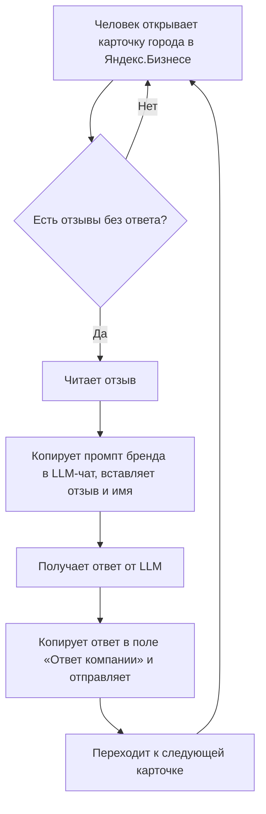
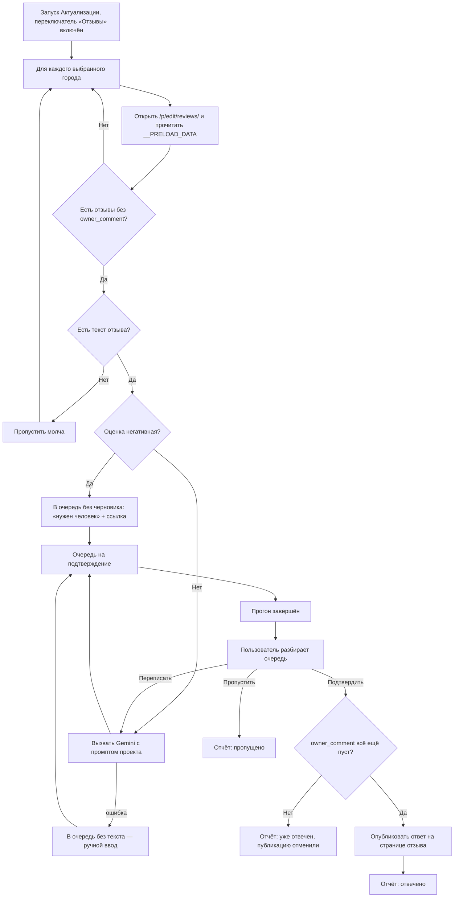
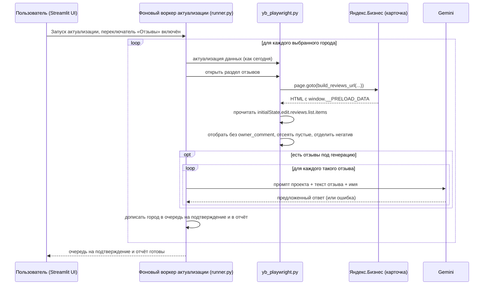
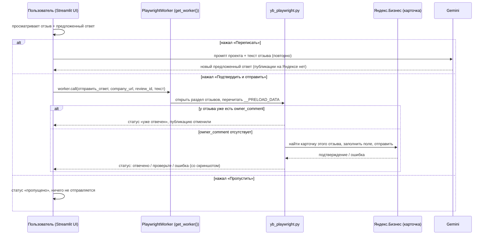

# Постановка: Отзывы в Click — поиск и ответ на неотвеченные отзывы с подтверждением

> Раздел не применим — помечен `N/A` с причиной, не удалён. Нумерация фиксирована для трассировки между разделами документа.
>
> **Редакция 3 (2026-08-04).** Получены ответы заказчика, файл промптов и сохранённая страница отзывов живой карточки. Главное техническое открытие: страница отзывов Яндекс.Бизнеса отдаёт **все отзывы готовым JSON внутри HTML** — разбирать вёрстку и искать «пустое поле ответа» не нужно. Подробности изменений — в разделе 17.

---

## 0. Шапка

| Поле | Значение |
|---|---|
| **Jira** | N/A — проект Autopilot вне ARAG/корпоративного трекера, отдельного тикета нет |
| **Vision / BRD** | N/A — формального документа нет; основа постановки — переписка в Telegram, код Click, документ с промптами и дамп живой страницы отзывов |
| **Описание** | В «Актуализацию» Click добавляется опциональный шаг: находить неотвеченные отзывы на карточках Яндекс.Бизнеса, предлагать ответ через LLM по промпту проекта, публиковать только после подтверждения человеком |
| **Зависимости** | Проект Click (миграция Node→Python завершена; доработки из `PLAN.md` идут параллельно и не блокируют эту фичу). Внешняя зависимость — Google Gemini API |
| **Заказчик** | Маркетинг-партнёр Autopilot (ведёт SMM и отзывы клиентских карточек) |
| **Автор постановки** | Vladislav |
| **Дата создания** | 2026-08-04 |
| **Статус документа** | Draft, редакция 3 |

---

## 1. Контекст и бизнес-цель

- **Бизнес-проблема:** ответы на отзывы на карточках Яндекс.Бизнеса — полностью ручной процесс. Промпт под бренд написан для всех пяти проектов Click, но масштаба это не решает: человеку всё равно приходится вручную обойти карточки в поисках неотвеченных отзывов, вставить каждый в промпт, прогнать через LLM, скопировать результат и вставить в Яндекс — и это на 60–144 города на бренд.
- **Бизнес-цель:** убрать ручной обход карточек и ручной перенос текста между LLM и Яндексом, не теряя контроль над тем, что публикуется под именем бренда — ответ уходит только после подтверждения человеком.
- **Метрика успеха (KPI):** черновая, точные цифры не согласованы — доля отзывов с ответом и среднее время от появления отзыва до ответа. Точные целевые значения — см. Q-7.
- **Срок / приоритет:** не зафиксирован. Приоритет считать SHOULD, если не будет сказано иначе.

---

## 2. Ключевые источники информации

### 2.1. Глоссарий

| Термин | Определение |
|---|---|
| Отзыв | Отзыв клиента на карточке компании в Яндекс.Бизнесе |
| Карточка | Профиль компании на Яндекс.Бизнесе для одного города/филиала |
| Актуализация | Существующий раздел Click, который заходит на карточку каждого города и жмёт «Данные актуальны» (порт `actualize.js`) |
| Проект | Один из брендов, которыми управляет Click как отдельным аккаунтом Яндекса (СМУ, ИМП, МПЭ, МПИ, АПС) |
| Промпт | Инструкция для LLM, настроенная отдельно на каждый проект, по которой формируется предложенный ответ на отзыв |
| Ассортиментная фраза | Фиксированная фраза о товарном ассортименте бренда, которую промпт обязан органично вписать в ответ — своя у каждого бренда |
| Предложенный ответ | Черновик ответа от LLM, который не публикуется, пока человек его не подтвердит |
| Очередь на подтверждение | Собранные за прогон пары «отзыв → предложенный ответ», ждущие решения человека |
| `__PRELOAD_DATA` | JSON-состояние страницы, которое Яндекс кладёт прямо в HTML раздела отзывов; из него читается весь список отзывов |
| `owner_comment` | Поле отзыва в этом JSON, где лежит ответ компании. Его отсутствие = отзыв неотвечен |

### 2.2. Источники

- **Репозиторий Click (прочитан по коду, а не по README):** `streamlit_app.py`, `runner.py`, `yb_playwright.py`, `ui_theme.py`, `projects_data.py`, `repo_store.py`, `playwright_worker.py`, `paths.py`, `kp_sheet.py`, `tests_click.py`, `tests_runner_e2e.py`, `PLAN.md`, `ВЕРСИИ.md`
- ⚠️ **`README.md` устарел** и не является источником: в нём «три проекта» и «СМУ — Стальметгрупп», тогда как в коде пять проектов и СМУ — Стальметурал. `README.md` нужно поправить в рамках этой же задачи (см. 5.1).
- **Сохранённая страница раздела отзывов живой карточки** `https://yandex.ru/sprav/20761435635/p/edit/reviews/` (АвиаПромСталь, 13 отзывов, из них 1 без ответа) — основной технический источник по структуре данных, разобран построчно
- **`ПРОМТЫ_на_отзывы.docx`** — промпты и примеры «отзыв → ответ» для пяти брендов: Авиапромсталь, Инметпром, Стальметурал, Метпромэнерго, МетПромИнтекс. Получен, разобран, переносится в код дословно
- Скриншот карточки отзывов с быстрыми кнопками Яндекса («Спасибо, мы старались» и т.п.) и полем «Ответ компании»
- Эталонная пара «отзыв Егора Севастьянова → ответ», присланная заказчиком в двух вариантах (АПС и МПИ) — используется как проверочный пример
- Ответы заказчика на вопросы редакции 2 (в чате, 2026-08-04)

### 2.3. Заинтересованные стороны

| Сторона | Роль | Требования / интересы |
|---|---|---|
| Vladislav | Разработчик (весь стек) | Реализация вписывается в архитектуру Click без переписывания существующей публикации/актуализации |
| Маркетинг-партнёр Autopilot | Заказчик, ежедневный пользователь фичи, владелец контента промптов | Быстрые, качественные, разрешённые к публикации ответы под именем бренда; ничего не публикуется без её проверки |
| Клиентские бренды — все пять проектов Click | Конечные бенефициары | Своевременные, уместные ответы на отзывы под их именем — ошибка здесь репутационно дороже ошибки в посте |

**Проекты Click по факту кода** (`streamlit_app.py:80-103`) — и сопоставление с промптами из `ПРОМТЫ_на_отзывы.docx`:

| Код | Бренд в приложении | Города | Промпт на отзывы | Характер промпта |
|---|---|---|---|---|
| `SMU` 🏗 | **Стальметурал** (юр. лицо Стальметгрупп; бренд переименован осознанно — коммит `0d7750c`) | 117, зашиты | ✅ есть | 3 абзаца, подробно, ассортиментная фраза сразу после благодарности |
| `IMP` 🔩 | Инметпром | 144, зашиты | ✅ есть | единый блок 4–5 предложений, живой тон, закрытие «Команда Инметпром» без «С уважением» |
| `MPE` ⚡ | МетПромЭнерго | 142, зашиты | ✅ есть | строго 2 абзаца, сухо, без воды |
| `MPI` 🛠 | МетПромИнтекс | из КП (Google-таблица) | ✅ есть | 2–3 предложения, **без обращения по имени**, без слова «команда», вводную фразу варьировать |
| `APS` ✈ | Авиапромсталь | ~62, зашиты | ✅ есть | строго 4 абзаца, официально, по 2 предложения на абзац |

Соответствие один к одному. Общее ограничение во всех пяти промптах: запрещены слова «база», «металлобаза», «магазин», «склад», «металлопрокатный центр»; название бренда — ровно 1 раз.

---

## 3. Текущее состояние (As-Is)

В коде Click нет ничего, связанного с отзывами. Единственное вхождение слова «review» в репозитории — служебный `REVIEW.md` про код-ревью миграции; ни `отзыв`, ни `reviews` в коде не встречаются вообще.

Текст ответа при этом с нуля не пишется: для всех пяти брендов есть развёрнутые промпты, рассчитанные на ручную вставку в LLM-чат — человек копирует промпт под нужный бренд, дописывает туда текст конкретного отзыва и имя автора, получает ответ от LLM и переносит его в Яндекс.Бизнес руками.

**Известные ограничения:**
- Не масштабируется на 60–144 города на бренд — даже с готовым промптом поиск неотвеченных отзывов и перенос ответа остаются полностью ручными
- Нет единого списка «что осталось без ответа» — только обход карточек одна за другой
- Промпты живут в `.docx` на стороне заказчика, а не в приложении: их нельзя ни применить автоматически, ни версионировать

**Сценарий As-Is**

1. Человек вручную открывает карточку компании на Яндекс.Бизнесе для конкретного города.
2. Переходит в раздел «Отзывы», визуально ищет отзывы без ответа компании.
3. Копирует промпт нужного бренда в LLM-чат, вставляет туда текст отзыва и имя автора, получает ответ.
4. Копирует полученный ответ в поле «Ответ компании» и отправляет.
5. Повторяет шаги 1–4 для следующего города — вручную, без общего списка того, что осталось.

**Диаграмма процесса (Mermaid — вместо BPMN/Miro: команда из 2 человек не использует для этого проекта отдельный BPMN-тулинг)**

---

## 4. Целевое состояние (To-Be)

Фича встраивается в существующий раздел **«🔄 Актуализация»** как опциональный переключатель — отдельного раздела или бота не заводим.

При включённом переключателе для каждого выбранного города, помимо текущей логики актуализации, система заходит на страницу отзывов карточки, **читает список отзывов из JSON-состояния страницы**, отбирает неотвеченные и формирует по каждому предложенный ответ через Gemini — по промпту, настроенному для проекта этой карточки. Все пять промптов переносятся в код как заводские значения, без изменения содержания.

Ничего не публикуется автоматически. Собранная очередь ждёт человека: по каждому отзыву можно отправить черновик как есть, попросить переписать или пропустить. Публикация — после завершения прогона, чтобы не поднимать второй браузер на тот же вход в Яндекс.

**Отдельные правила отбора и генерации** (по решениям заказчика):
- **Негативный отзыв** — черновик не генерируется вообще. Отзыв попадает в очередь с пометкой «нужен человек» и ссылкой на карточку, дальше заказчик отвечает вручную.
- **Отзыв без текста** (только звёзды) — пропускается молча, в очередь не попадает.
- **Возраст отзыва не важен** — отвечаем и на старые неотвеченные.
- **Имя автора** подставляется, только если оно похоже на нормальное человеческое имя; иначе в обращении используется «Клиент». Для МПИ обращения по имени нет вообще — так написан его промпт.

**Ключевые отличия от As-Is:** список неотвеченных отзывов собирается сам; копирование между LLM-чатом и Яндексом заменяется одним экраном подтверждения; публикация — тот же клик, но по уже готовому тексту; промпты живут в приложении и правятся из него.

**Сценарий To-Be**

1. Пользователь в разделе «Актуализация» выбирает города/проект как обычно и включает переключатель «Также проверить и ответить на отзывы».
2. Запускает прогон (как сегодня — `start_actualize`).
3. Для каждого города, вместе с текущей логикой `actualize_city`, система открывает раздел отзывов карточки и читает список отзывов из `window.__PRELOAD_DATA`.
4. Отбирает отзывы **без** `owner_comment` — это и есть неотвеченные. Отсеивает отзывы без текста; негативные откладывает без генерации.
5. Для каждого оставшегося отзыва вызывается Gemini с промптом проекта — получается предложенный текст ответа.
6. Пары «отзыв → предложенный ответ» складываются в очередь на подтверждение — ничего не публикуется автоматически.
7. После завершения прогона пользователь просматривает очередь и по каждому отзыву может: (а) подтвердить — система открывает карточку, находит этот отзыв и публикует текст; (б) «переписать» — новый вызов Gemini, новый вариант, публикации нет; (в) пропустить.
8. Перед самой отправкой система заново читает состояние этого отзыва: если `owner_comment` там уже появился — публикация отменяется, отзыв помечается «уже отвечен».
9. Итог отражается в отчёте прогона: найдено / отвечено / пропущено / отдано человеку по каждому городу.

**Альтернативный путь — Gemini недоступен или вернул ошибку**
- Отзыв всё равно попадает в очередь, но без предложенного текста — вместо него открытое поле для ручного ввода. Обработка остальных отзывов и городов не прерывается.

**Диаграмма целевого процесса (Mermaid)**

---

## 5. Scope

### 5.1. Входит

- [ ] Переключатель в разделе «Актуализация», включающий обработку отзывов для выбранных городов в том же прогоне
- [ ] Чтение списка отзывов из `window.__PRELOAD_DATA` раздела отзывов карточки; неотвеченный = нет `owner_comment`
- [ ] Отсев отзывов без текста; выделение негативных в «нужен человек» без генерации
- [ ] Генерация предложенного ответа через Gemini по промпту, настроенному отдельно для каждого проекта
- [ ] Правило подстановки имени автора (нормальное имя / «Клиент»)
- [ ] Экран проверки: отзыв + предложенный ответ + действия «Подтвердить и отправить» / «Переписать» / «Пропустить»
- [ ] Перепроверка состояния отзыва непосредственно перед отправкой (защита от дубля)
- [ ] Публикация подтверждённого ответа на реальной странице конкретного отзыва
- [ ] Отчёт по прогону: найдено / отвечено / пропущено / нужен человек по каждому городу — вместе с правкой рендера отчётов в `ui_theme.py`
- [ ] Настройка промпта по проекту в приложении (по аналогии с редактором «Окончания постов»), с хранением через `repo_store`
- [ ] Перенос пяти готовых промптов в код как заводские значения — дословно
- [ ] Новый раздел про отзывы в `README.md` **и правка устаревших мест README**: «три проекта» → пять, «Стальметгрупп» → Стальметурал

### 5.2. НЕ входит (out of scope)

- Отдельный Telegram-бот — отклонён: фича идёт внутрь Click
- Полностью автоматическая публикация без подтверждения человеком
- Автоматический ответ на негативные отзывы — по решению заказчика их вообще не генерируем
- Автопостинг в соцсети (Instagram/VK и т.п.) — отложен на будущее
- Написание содержания промптов разработчиком — не требуется, промпты готовы на все пять проектов
- Заведение новых проектов Click — не требуется, все пять брендов уже заведены
- Пагинация отзывов глубже первой страницы (первая страница вмещает 20 отзывов — см. 5.3)
- Использование встроенной генерации Яндекса (`can_generate_answer` в данных отзыва) — она не знает промптов бренда
- Ответы на отзывы вне Яндекс.Бизнеса (2ГИС, Google, Отзовик и т.п.)

### 5.3. Допущения

- **Подтверждено дампом живой страницы:** адрес раздела — `https://yandex.ru/sprav/{id}/p/edit/reviews/`, то есть ровно та же схема, что у «Постов» и «Фото» (`build_posts_url` / `build_photos_url`, `yb_playwright.py:129-191`). Значит, `build_reviews_url()` — тривиальный аналог, с тем же запасным форматом `/edit/` ↔ `/p/edit/`
- **Подтверждено:** HTML страницы содержит `window.__PRELOAD_DATA` с полным списком отзывов по пути `initialState.edit.reviews.list`. Разбирать вёрстку для чтения не нужно
- **Подтверждено:** страница отдаёт до 20 отзывов за раз (`pager: {limit: 20, offset: 0, total: 13}`). Для карточки с ≤20 отзывами первая страница — это все отзывы. Карточки с бо́льшим числом отзывов существуют, но за первую страницу не выходим
- Действующая сессия Яндекс.Бизнеса, используемая для публикации/актуализации, даёт доступ и к разделу отзывов той же карточки — на дампе видно, что страница отдаётся залогиненному владельцу карточки
- Публикация ответа делается через интерфейс (заполнить поле, нажать отправку), как и публикация постов. В данных отзыва есть `business_answer_csrf_token`, что намекает на возможность прямого API-вызова, но эндпоинт не подтверждён — в MVP не используем
- Объём отзывов на карточку невелик: на разобранной карточке 13 отзывов, из них 1 без ответа
- Результат генерации — черновик; ничего не публикуется без явного клика пользователя

### 5.4. Ограничения

- Новый функционал работает в рамках существующих механизмов Click: фоновый воркер актуализации (`runner.py:934`) для сбора и `PlaywrightWorker`/`get_worker()` (`streamlit_app.py:554`) для синхронных действий из UI-потока — не отдельный сервис
- **Один браузер на сессию Яндекса.** Фоновый прогон держит свой `YbBrowser` под локом (`_acquire_lock`, `runner.py:269`), а `get_worker()` — отдельный экземпляр браузера с тем же файлом сессии, и лок он не проверяет. Решение: публикация ответов доступна только после завершения прогона (НФТ-5)
- На Streamlit Cloud нет постоянной файловой системы: промпты и очередь на подтверждение обязаны сохраняться через `repo_store.py` — тем же способом, что окончания постов и города
- `requirements.txt` закреплён по версиям намеренно. Gemini вызываем обычным HTTPS-запросом через `requests` (уже в зависимостях), без SDK
- Ключ Gemini хранится в секретах Streamlit, как `gcp_service_account_b64` (`kp_sheet.py:159-170`), и не попадает в репозиторий
- Бесплатный тариф Gemini имеет лимиты по числу запросов в минуту и в сутки — при прогоне на сотню городов в них можно упереться; нужен мягкий ретрай с паузой и понятное сообщение в логе
- Параметры прогона в Click намеренно не настраиваются пользователем (`get_settings`, `streamlit_app.py:342`) — переключатель «Отзывы» это состояние экрана запуска, а не новая настройка

---

## 6. Требования

| # | Бизнес-требование (БТ) | Пользовательское требование (ПТ) | Функциональное требование (ФТ) | Нефункциональное требование (НФТ) |
|---|---|---|---|---|
| 1 | **БТ-1.** Бизнес ХОЧЕТ убрать ручной обход карточек и ручной перенос текста между LLM и Яндексом при ответах на отзывы, по всем городам, без потери контроля над публикуемым текстом | **ПТ-1.** Я, как человек, отвечающий за отзывы бренда, хочу видеть готовый список неотвеченных отзывов, чтобы не искать их вручную по десяткам карточек | **ФТ-1.** КОГДА пользователь запускает «Актуализацию» с включённым переключателем «Отзывы» для выбранных городов, система ДОЛЖНА для каждого города открыть раздел отзывов карточки, прочитать список отзывов из `window.__PRELOAD_DATA` и считать неотвеченными те, у которых отсутствует `owner_comment` | **НФТ-1.** Надёжность: шаг по отзывам не должен ломать уже работающий шаг актуализации данных для этого же города. Ожидаемое удлинение прогона — см. 14.1 |
| 2 | | **ПТ-2.** Я хочу, чтобы система сама предлагала текст ответа в стиле, заданном для конкретного бренда, чтобы ответ соответствовал этому проекту, а не звучал как чужой шаблон | **ФТ-2.** КОГДА найден неотвеченный отзыв с текстом и неотрицательной оценкой, система ДОЛЖНА сформировать предложенный ответ, вызвав Gemini с промптом, настроенным для проекта этой карточки | **НФТ-2.** Изоляция: промпт одного проекта не должен применяться к отзывам другого проекта (по аналогии с уже разделёнными per-проект окончаниями постов) |
| 3 | | **ПТ-3.** Я хочу видеть отзыв и предложенный ответ рядом и одним действием либо отправить его, либо попросить переписать, чтобы контролировать, что публикуется от имени бренда | **ФТ-3.** КОГДА предложенный ответ показан, система ДОЛЖНА предоставить действия «Подтвердить и отправить», «Переписать» и «Пропустить». **ФТ-4.** КОГДА нажато «Переписать», система ДОЛЖНА повторно вызвать Gemini и показать новый вариант, не публикуя ничего на Яндекс.Бизнесе. **ФТ-5.** КОГДА нажато «Подтвердить и отправить», система ДОЛЖНА перейти к этому отзыву на реальной странице карточки и опубликовать подтверждённый текст | |
| 4 | | **ПТ-4.** Я хочу быть уверен(а), что один отзыв не получит два разных ответа при повторных прогонах | **ФТ-6.** КОГДА у отзыва есть `owner_comment` (в т.ч. проставленный этим же инструментом ранее), система НЕ ДОЛЖНА предлагать по нему ответ, а перед самой отправкой ДОЛЖНА перечитать состояние отзыва и отменить публикацию, если ответ там появился | **НФТ-3.** Идемпотентность обеспечивается состоянием самой страницы; отдельный реестр дублей, как для постов (`.published.jsonl`), для MVP не требуется |
| 5 | | **ПТ-5.** Я хочу видеть после прогона, что произошло с отзывами, чтобы понимать, что сделано инструментом, а что осталось | **ФТ-7.** КОГДА прогон с шагом «Отзывы» завершён, система ДОЛЖНА показать отчёт: найдено / отвечено / пропущено / отдано человеку по каждому городу | |
| 6 | | **ПТ-6.** Я хочу, чтобы сбой генерации ответа по одному отзыву не остановил всю обработку | **ФТ-8.** КОГДА вызов Gemini завершился ошибкой, лимитом или пустым ответом, система ДОЛЖНА показать отзыв без предложенного текста и дать ввести ответ вручную, не прерывая обработку остальных отзывов и городов | |
| 7 | **БТ-2.** Бизнес ХОЧЕТ, чтобы собранная работа не пропадала между сеансами — иначе прогон на 140 городов придётся повторять | **ПТ-7.** Я хочу вернуться к очереди неподтверждённых ответов позже (в т.ч. после перезапуска приложения), а не подтверждать всё за один присест | **ФТ-9.** КОГДА собрана очередь на подтверждение, система ДОЛЖНА сохранить её так, чтобы она пережила перезапуск приложения, включая пересборку контейнера в облаке | **НФТ-4.** Хранение — через `repo_store` (ветка `click-data`), как города и окончания постов; локальный файл только как кэш |
| 8 | | **ПТ-8.** Я хочу править промпт бренда прямо в приложении, не трогая код и не прося разработчика | **ФТ-10.** КОГДА пользователь открыл настройку промпта проекта, система ДОЛЖНА показать текущий текст, дать его изменить, сохранить и вернуть к заводскому варианту | **НФТ-5.** Интерактивная публикация ответа НЕ должна быть доступна, пока идёт фоновый прогон того же проекта — иначе два браузера на один файл сессии |
| 9 | **БТ-3.** Бизнес НЕ ХОЧЕТ, чтобы машина отвечала на негатив от имени бренда — цена ошибки там максимальная | **ПТ-9.** Я хочу, чтобы негативные отзывы система мне просто показывала со ссылкой, а не пыталась на них отвечать | **ФТ-11.** КОГДА у неотвеченного отзыва оценка признана негативной, система НЕ ДОЛЖНА вызывать LLM, а ДОЛЖНА поместить отзыв в очередь со статусом «нужен человек» и прямой ссылкой на раздел отзывов этой карточки | |
| 10 | | **ПТ-10.** Я хочу, чтобы в ответе не появлялось странное или оскорбительное имя автора | **ФТ-12.** КОГДА в ответе требуется обращение по имени, система ДОЛЖНА подставить имя автора, только если оно распознано как нормальное человеческое имя; иначе — «Клиент». Для проекта МПИ обращение по имени не используется вовсе (так задан его промпт) | |
| 11 | | **ПТ-11.** Я не хочу видеть в очереди отзывы, где нечего читать и не на что отвечать | **ФТ-13.** КОГДА у неотвеченного отзыва пустой текст (проставлены только звёзды), система ДОЛЖНА пропустить его, не вызывая LLM и не помещая в очередь | |

**Замечание по формулировкам:** «негативная оценка» намеренно не зашита числом в требование — порог задаётся настройкой, значение по умолчанию согласуем (Q-15).

### 6.1. Требования сопровождения

- **Документация:** новый раздел в `README.md` Click, плюс правка устаревших мест (число проектов, имя бренда СМУ)
- **Дежурные / алерты:** N/A — соло-разработка без дежурной смены; ошибки видны в живом логе
- **SLA / RTO / RPO:** N/A — внутренний инструмент агентства, не внешний сервис
- **Регулярные операции:** периодический пересмотр промпта по проекту — TODO кто и как часто, см. Q-5
- **Расходы:** Gemini на бесплатном тарифе; если упрёмся в лимиты — решение о платном тарифе принимает заказчик

---

## 7. Дизайн решения

### 7.1. Архитектура

N/A в формате Miro-доски — команда не ведёт отдельную архитектурную доску. Архитектура ниже — текстом и Mermaid-диаграммами вместо неё.

Новый функционал не создаёт отдельный сервис, а расширяет существующие слои Click:

- **UI (`streamlit_app.py`):** переключатель в `tab_actualize` (`:1453`); экран проверки/подтверждения очереди; редактор промпта проекта по образцу `_endings_editor` (`:1075`)
- **Оркестрация (`runner.py`):** шаг сбора встраивается в `start_actualize` (`:899`) / `_actualize_worker` (`:934`), рядом с вызовом `yb.actualize_city`; логи через `_append_log` (`:191`), отчёт — в `reports-actualize/`
- **Браузер (`yb_playwright.py`):** новая `build_reviews_url()` по образцу `build_posts_url` (`:129`) и `alt_posts_url` (`:167`); чтение отзывов через `page.evaluate("window.__PRELOAD_DATA")`; публикация ответа на конкретный отзыв через интерфейс — клик по локатору с пометкой элемента data-атрибутом, как предписывает `PLAN.md` 1.1
- **Интерактивный канал (`playwright_worker.py` / `get_worker()`):** синхронный клик «Подтвердить и отправить», как сегодня идёт весь флоу входа в Яндекс
- **Рендер отчёта (`ui_theme.py`):** словари статусов (`:1094`, `:1138`) и `_ACT_TILES` (`streamlit_app.py:1778`) дополняются исходами по отзывам
- **Хранение (`repo_store.py`):** промпт проекта — ключом `reviews-prompt-{project_id}` по образцу `endings-{project_id}`; очередь — ключом `reviews-queue-{project_id}`
- **Новый модуль генерации (`llm.py`):** HTTPS-вызов Gemini через `requests`, промпт проекта + текст отзыва + имя, обработка ошибок, таймаутов и лимитов

### 7.2. Затронутые компоненты

| Компонент | Тип изменения | Описание |
|---|---|---|
| `streamlit_app.py` | Изменение | Переключатель в `tab_actualize`; экран очереди и подтверждения; редактор промпта проекта; передача флага в `save_actualize_tasks` (`:518`) и `start_actualize` |
| `runner.py` | Изменение | `start_actualize`/`_actualize_worker` дополняется опциональным шагом по отзывам; новые счётчики и раздел отчёта |
| `yb_playwright.py` | Изменение + новое | `build_reviews_url()`; чтение `__PRELOAD_DATA`; публикация ответа; перепроверка состояния отзыва перед отправкой (по образцу `check_post_already_exists`, `:740`) |
| `ui_theme.py` | Изменение | Статусы и плашки отчёта для исходов по отзывам |
| `repo_store.py` | Без изменений, переиспользуется | Новые ключи `reviews-prompt-*` и `reviews-queue-*` через существующие `load`/`save` |
| `playwright_worker.py` / `get_worker()` | Без изменений, переиспользуется | Синхронный канал для интерактивного клика «Подтвердить и отправить» |
| `projects_data.py` | Изменение | Пять готовых промптов как заводские значения по проектам |
| `llm.py` | Новый | Вызов Gemini, изоляция промпта по `project_id`, ретраи при лимитах |
| `tests_click.py`, `tests_runner_e2e.py` | Изменение | Разбор `__PRELOAD_DATA` на реальной фикстуре (сохранённая страница), сборка URL, правило имени, сквозной прогон с заглушками |
| `README.md` | Изменение | Новый раздел про отзывы + правка устаревших мест |
| Секреты Streamlit | Изменение | Ключ Gemini |

### 7.3. Методы

Контракт в формате OpenAPI — **N/A**: это не REST-сервис с внешним API, а функции внутри Streamlit-приложения и слой браузерной автоматизации. Ниже — два ключевых потока, каждый с UML Sequence (Mermaid) → сценарий → модель данных.

---

#### Поток A: сбор неотвеченных отзывов и генерация черновиков (фоновый шаг актуализации)

**(1) UML Sequence-диаграмма**

**(2) Сценарий**

1. Фоновый воркер для каждого выбранного города, если переключатель включён, после `actualize_city` открывает раздел отзывов через `build_reviews_url()`; при 404 пробует альтернативный формат адреса, как это делает публикация постов.
2. Читает `window.__PRELOAD_DATA` → `initialState.edit.reviews.list.items`.
3. Отбирает отзывы без `owner_comment`. Отзывы с пустым `full_text` пропускает. Отзывы с негативной оценкой откладывает со статусом «нужен человек», LLM не вызывает.
4. Для остальных вызывает Gemini с промптом проекта, подставляя текст отзыва и имя автора по правилу ФТ-12.
5. Если Gemini вернул ошибку или упёрся в лимит — отзыв всё равно попадает в очередь, но без текста (ФТ-8).
6. Результаты по городу пишутся в очередь и в отчёт **по ходу**, а не в конце, чтобы оборванный прогон не терял собранное.

**Альтернативные / ошибочные сценарии:**
- Раздел отзывов не открылся (404 / редирект на логин) → город помечается ошибкой, как в `actualize_city`; при сбое сохраняется скриншот (`_save_failure_screenshot`, `runner.py:670`)
- `__PRELOAD_DATA` на странице не оказалось (Яндекс поменял отдачу) → город помечается ошибкой с явной причиной, сохраняется HTML-дамп для разбора
- Промпт проекта пуст → отзывы собираются, но без черновиков, с подсказкой «настройте промпт»
- Отзывов на карточке больше 20 → берём первую страницу, в лог пишем, сколько осталось за кадром

**(3) Модель данных**

Поля отзыва берутся 1:1 из данных Яндекса — они подтверждены дампом:

| Поле в `__PRELOAD_DATA` | Что это | Как используем |
|---|---|---|
| `id` | идентификатор отзыва | ключ отзыва в очереди, поиск отзыва на странице при публикации |
| `author.user` | имя автора («Егор Севастьянов», «Надежда Х.», «Денис») | подстановка в обращение по правилу ФТ-12 |
| `full_text` | полный текст отзыва | вход для промпта; пустой — отзыв пропускаем |
| `rating` | оценка 1–5 | признак негатива (порог — Q-15) |
| `time_created` | время создания, мс | показ даты в очереди; на отбор не влияет |
| `owner_comment.text` | ответ компании | **отсутствует → отзыв неотвечен** |
| `business_answer_csrf_token` | токен на ответ | в MVP не используем, фиксируем как задел |
| `can_generate_answer` | признак штатной генерации Яндекса | не используем |
| `list.pager` | `{limit, offset, total}` | сколько всего отзывов и сколько осталось за первой страницей |

| Сущность | Поля | Изменение |
|---|---|---|
| Элемент очереди | `review_id`, `project_id`, `city`, `company_url`, `author`, `rating`, `text`, `created_at`, `status` (`drafted` / `needs-human` / `no-draft` / `answered` / `skipped` / `already-answered` / `failed`), `draft`, `final_text`, `collected_at` | Новая структура. Хранение — `repo_store`, ключ `reviews-queue-{project_id}`; локальный файл как кэш |
| Промпт проекта | `project_id`, текст промпта | Новый ключ `reviews-prompt-{project_id}` в `repo_store`; заводское значение — в `projects_data.py` |

---

#### Поток B: подтверждение и публикация ответа на конкретный отзыв (интерактивно, после прогона)

**(1) UML Sequence-диаграмма**

**(2) Сценарий**

1. Пользователь открывает очередь после завершения прогона (во время прогона отправка заблокирована — НФТ-5).
2. «Переписать» → повторный вызов Gemini, браузер не задействован, ничего не публикуется.
3. «Подтвердить и отправить» → синхронный вызов через `get_worker()` открывает раздел отзывов, перечитывает `__PRELOAD_DATA` и сверяет `owner_comment` именно этого `id`. Если пусто — находит карточку отзыва в интерфейсе, заполняет поле и отправляет.
4. «Пропустить» → отзыв помечается пропущенным, из очереди убирается.
5. Результат сразу отражается в интерфейсе и в отчёте прогона.

**Альтернативные сценарии:**
- Публикация не подтвердилась однозначно → статус «Проверьте», как у публикации постов
- Отзыв успел получить ответ от другого человека → шаг 3 это ловит, публикации не происходит
- Идёт фоновый прогон этого же проекта → кнопка отправки заблокирована (НФТ-5)
- Сессия Яндекса слетела → та же подсказка «войдите в Яндекс», что и в остальных разделах

**(3) Модель данных**

Использует ту же сущность «Элемент очереди», что и Поток A — обновляет `status` и `final_text`.

---

## 8. Миграции и план выкатки

- **Тип релиза:** N/A в классическом смысле — self-hosted инструмент на 1–2 пользователей; практически обновление кода и ручная проверка
- **Backward compatibility:** да — фича опциональна (переключатель выключен по умолчанию), существующая публикация/актуализация не меняется
- **Миграции данных:** обязательных нет — промпты приезжают заводскими значениями в коде, очередь создаётся пустой
- **План раскатки:**
  1. Разработка и автотесты на сохранённой странице отзывов как на фикстуре
  2. Обкатка на 1–3 городах пилотного проекта, где точно есть неотвеченный отзыв
  3. Полный цикл глазами: сбор → черновик → переписать → подтвердить → опубликовано на живой карточке
  4. Прогон на полном одном проекте
  5. Включение на остальных проектах
- **Rollback-план:** выключить переключатель. Полный откат кода — по процедуре из `ВЕРСИИ.md` (ветка `rollback-good`)

---

## 9. Наблюдаемость и эксплуатация

### 9.1. Логи
Расширить живой лог актуализации (`_append_log`, `runner.py:191`) записями по каждому городу: сколько отзывов всего, сколько без ответа, сколько ушло в генерацию, сколько отложено человеку, сколько пропущено. Отдельно логировать: раздел отзывов не открылся, `__PRELOAD_DATA` не найден, Gemini не ответил или упёрся в лимит, публикация отменена из-за появившегося ответа, отзывы за пределами первой страницы.

### 9.2. Метрики Prometheus
N/A — self-hosted Streamlit-инструмент без Prometheus-инфраструктуры.

### 9.3. Дашборды Grafana
N/A — по той же причине.

### 9.4. Алерты
N/A — нет дежурной смены; ошибки видны в живом логе и в отчёте.

### 9.5. Runbook
Короткий troubleshooting-раздел в `README.md`: «не находит отзывы», «Gemini не отвечает / лимит», «ответ не отправился», «Яндекс поменял страницу» — по аналогии с существующим разделом «Про Streamlit Cloud».

---

## 10. Тестирование

### 10.1. Стратегия
Главный выигрыш: **сохранённая страница отзывов становится честной фикстурой**. Разбор `__PRELOAD_DATA` тестируется на реальных данных без браузера — в `tests_click.py`, рядом с существующими проверками URL и текста. Сквозной прогон — в `tests_runner_e2e.py` с заглушками браузера и Gemini, по образцу уже протестированных публикации и актуализации. Ручная проверка на реальной карточке обязательна перед боевым использованием.

### 10.2. Тест-кейсы (high-level)

| ID | Сценарий | Привязка к ФТ | Ожидаемый результат | Приоритет |
|---|---|---|---|---|
| TC-1 | Happy path: карточка с 1 неотвеченным отзывом → предложен ответ → подтверждён → опубликован | ФТ-1, ФТ-2, ФТ-3, ФТ-5 | Отзыв получает ответ, отчёт показывает 1 отвечен | P0 |
| TC-2 | Карточка без неотвеченных отзывов | ФТ-1 | Город помечен «нет отзывов для ответа», прогон не падает | P1 |
| TC-3 | «Переписать» нажат один или несколько раз до подтверждения | ФТ-4 | Каждый раз новый вариант, ничего не публикуется до явного подтверждения | P0 |
| TC-4 | Gemini возвращает ошибку/таймаут/лимит | ФТ-8 | Отзыв показан без предложенного текста, доступен ручной ввод, остальные города обрабатываются | P1 |
| TC-5 | Отзыв ответили вручную между сбором и подтверждением | ФТ-6 | Публикация отменена, статус «уже отвечен», дубля нет | P0 |
| TC-6 | Промпт проекта очищен пользователем | ФТ-2, ФТ-10 | Понятная подсказка «настройте промпт», а не молчаливый сбой | P2 |
| TC-7 | Переключатель «Отзывы» выключен | ФТ-1 | Прогон идёт ровно как сегодня, ни одного обращения к отзывам и к Gemini | P0 |
| TC-8 | Приложение перезапущено с непустой очередью | ФТ-9 | Очередь на месте, черновики не потеряны | P1 |
| TC-9 | Промпт проекта A не применяется к отзывам проекта B | НФТ-2 | В запрос к Gemini уходит промпт того проекта, чья карточка обрабатывается | P0 |
| TC-10 | Попытка отправить ответ во время идущего прогона | НФТ-5 | Отправка недоступна с понятным пояснением, второй браузер не поднимается | P1 |
| TC-11 | **Разбор реальной фикстуры:** сохранённая страница АвиаПромСталь, 13 отзывов | ФТ-1 | Ровно 1 неотвеченный (Егор Севастьянов), остальные 12 отсеяны по `owner_comment` | P0 |
| TC-12 | Негативный отзыв среди неотвеченных | ФТ-11 | Черновик не генерируется, статус «нужен человек», в очереди есть ссылка на карточку | P0 |
| TC-13 | Отзыв без текста (только звёзды) | ФТ-13 | Пропущен молча, LLM не вызван, в очередь не попал | P1 |
| TC-14 | Имя автора нестандартное или оскорбительное | ФТ-12 | В обращении «Клиент», исходное имя в текст ответа не попадает | P1 |
| TC-15 | Проект МПИ | ФТ-12 | В ответе нет обращения по имени вообще и нет слова «команда» | P1 |
| TC-16 | Эталонная пара заказчика (отзыв Егора Севастьянова) | ФТ-2 | Сгенерированный ответ по смыслу и структуре соответствует присланному эталону бренда | P2 |

### 10.3. Нагрузочное тестирование
N/A для MVP. Ожидаемое удлинение прогона посчитано в 14.1 и проверяется замером на пилоте.

---

## 11. Критерии приёмки (AC / DoD)

- [ ] Все ФТ-1…ФТ-13 реализованы и вручную проверены на реальной карточке
- [ ] Переключатель «Отзывы» не меняет поведение прогона, если выключен
- [ ] Ни один ответ не публикуется без явного «Подтвердить и отправить»
- [ ] «Переписать» не публикует ничего на Яндекс.Бизнесе
- [ ] На негативные отзывы черновик не генерируется вообще
- [ ] Один и тот же отзыв не получает два разных ответа при повторных прогонах
- [ ] Промпт настраивается отдельно на каждый проект и не путается между проектами
- [ ] Пять готовых промптов перенесены дословно
- [ ] Очередь на подтверждение переживает перезапуск приложения
- [ ] Ключ Gemini живёт в секретах, в репозиторий не попадает
- [ ] `tests_click.py` / `tests_runner_e2e.py` дополнены (в т.ч. TC-11 на реальной фикстуре) и проходят зелёными
- [ ] `README.md` обновлён разделом про отзывы и исправлен в части числа проектов и имени бренда СМУ
- [ ] Продемонстрировано минимум на одном реальном проекте с реальными отзывами

---

## 12. Открытые вопросы

| # | Вопрос | Владелец | Срок | Статус | Решение / комментарий |
|---|---|---|---|---|---|
| Q-1 | Какой LLM-провайдер использовать? | Vladislav | 2026-08-04 | РЕШЕНО | **Google Gemini** (бесплатный ключ Google AI Studio). Осталось передать сам ключ — см. Q-17 |
| Q-2 | Глубина сканирования отзывов | Vladislav | 2026-08-04 | РЕШЕНО | Только первая страница. По факту это до 20 отзывов (`pager.limit=20`), пагинацию не трогаем |
| Q-3 | Заводить ли МетПромИнтекс, Авиапромсталь и Стальметурал проектами Click? | — | 2026-08-04 | РЕШЕНО | Не требуется: МПИ и АПС уже заведены, а Стальметурал — это проект СМУ |
| Q-4 | Нужна ли кнопка «Пропустить»? | Vladislav | 2026-08-04 | РЕШЕНО | Да, включена в ФТ-3 |
| Q-5 | Как обрабатывать негативные отзывы? | маркетинг-партнёр | 2026-08-04 | РЕШЕНО | Не отвечать вообще: отдавать человеку со ссылкой на карточку (ФТ-11). Порог «негатива» — Q-15 |
| Q-6 | Как перепроверять «отзыв уже отвечен» перед публикацией? | Vladislav | 2026-08-04 | РЕШЕНО | Перечитывать `owner_comment` этого `id` из `__PRELOAD_DATA` непосредственно перед отправкой |
| Q-7 | Целевые числа для метрики успеха (доля отвеченных, срок ответа) | маркетинг-партнёр | — | НУЖНО УТОЧНИТЬ | Не блокирует разработку. По времени прогона ответ дан в 14.1 |
| Q-8 | Кто пишет промпт для СМУ? | — | 2026-08-04 | РЕШЕНО | Не требуется: СМУ = Стальметурал, промпт есть |
| Q-9 | Когда публиковать подтверждённые ответы? | Vladislav | 2026-08-04 | РЕШЕНО | Только после завершения прогона |
| Q-10 | Ограничивать ли число отзывов за прогон? | Vladislav | 2026-08-04 | РЕШЕНО | Да, потолок черновиков на город; значение по умолчанию — Q-16 |
| Q-11 | Отзывы без текста (только звёзды) | маркетинг-партнёр | 2026-08-04 | РЕШЕНО | Пропускать (ФТ-13). На разобранной карточке таких нет |
| Q-12 | Обращение по имени | маркетинг-партнёр | 2026-08-04 | РЕШЕНО | Нормальное имя — по имени; странное/оскорбительное — «Клиент» (ФТ-12). Детали распознавания — Q-18 |
| Q-13 | Отвечать ли на старые отзывы? | маркетинг-партнёр | 2026-08-04 | РЕШЕНО | Да, возраст отзыва не важен |
| Q-14 | Точный адрес и структура раздела отзывов | Vladislav | 2026-08-04 | РЕШЕНО | `https://yandex.ru/sprav/{id}/p/edit/reviews/`; данные — `window.__PRELOAD_DATA` → `initialState.edit.reviews.list` |
| Q-15 | Какая оценка считается негативной: только 1–2 звезды или 1–3? | маркетинг-партнёр | — | НУЖНО УТОЧНИТЬ | Предложение: 1–3 звезды — человеку, 4–5 — генерируем |
| Q-16 | Потолок черновиков на город | Vladislav | — | НУЖНО УТОЧНИТЬ | Предложение: 5. На реальной карточке неотвеченных единицы, так что потолок — страховка от аномалии |
| Q-17 | Ключ Gemini | Vladislav | — | НУЖНО УТОЧНИТЬ | Физически нужен ключ, чтобы подключить генерацию |
| Q-18 | Правило «нормального имени» | маркетинг-партнёр | — | НУЖНО УТОЧНИТЬ | Предложение: одно-два слова из букв, без цифр, ссылок и мата → берём как есть; «Надежда Х.» → «Надежда»; всё остальное → «Клиент» |
| Q-19 | Пилотный проект: заказчик назвал МПИ, но присланная карточка — АвиаПромСталь (АПС) | маркетинг-партнёр | — | НУЖНО УТОЧНИТЬ | Нужна ссылка на карточку МПИ с неотвеченным отзывом — либо пилотируем на АПС |

---

## 13. Риски и митигация

| # | Риск | Вероятность | Влияние | Митигация |
|---|---|---|---|---|
| R-1 | Неуместный черновик ответа публикуется под именем бренда | Низкая (было: средняя) | Высокое | Обязательное подтверждение человеком (ФТ-3/ФТ-5) + негатив вообще не генерируется (ФТ-11) |
| R-2 | Яндекс меняет структуру страницы отзывов → чтение ломается | Низкая–средняя (было: средняя) | Среднее | Читаем `__PRELOAD_DATA`, а не вёрстку — это устойчивее к редизайну. При отсутствии блока — явная ошибка и HTML-дамп. Фикстура в `tests_click.py` ловит регресс |
| R-3 | Gemini упирается в лимиты бесплатного тарифа при прогоне на 100+ городов | Средняя | Среднее | Черновики нужны только для неотвеченных — их единицы, а не сотни. Плюс мягкий ретрай с паузой, потолок на город (Q-16) и fallback на ручной ввод (ФТ-8) |
| R-4 | Дублирующийся ответ на один отзыв | Низкая | Среднее | Перепроверка `owner_comment` непосредственно перед публикацией (ФТ-6) |
| R-5 | Промпты содержат жёсткие словарные ограничения — LLM может их нарушить | Средняя | Низкое–среднее | Подтверждение человеком покрывает; при желании — автопроверка запрещённых слов («база», «склад», «магазин», «металлобаза», «металлопрокатный центр») и числа упоминаний бренда до показа ответа |
| R-6 | Два браузера на один файл сессии Яндекса | Низкая (было: средняя) | Высокое | Публикация только после прогона (НФТ-5) |
| R-7 | Очередь черновиков теряется при перезапуске контейнера | Высокая без митигации | Высокое | Хранение очереди через `repo_store` (ФТ-9, НФТ-4) |
| R-8 | Публикация ответа всё же требует работы с вёрсткой — там редизайн бьёт по-прежнему | Средняя | Среднее | Клик по локатору с пометкой элемента (`PLAN.md` 1.1) + скриншот при сбое. Задел: прямой вызов с `business_answer_csrf_token`, если UI окажется хрупким |
| R-9 | Ответ отправлен не тому отзыву (перепутан порядок на странице) | Низкая | Высокое | Отзыв ищется по `id` из данных, а не по позиции в списке; перед отправкой сверяется автор и текст |

---

## 14. Оценка и план

### 14.1. Оценка трудоёмкости и времени прогона

**Насколько удлинится прогон.** Расчёт по фактическим таймингам из кода (`actualize_city`, `runner.py`, `yb_playwright.py`) плюс типовая задержка Gemini.

Сейчас один город актуализации: открыть страницу 2–4 с + фиксированная пауза 2.5 с + поиск кнопки 0.4–4 с + ожидание тоста 0.3–6 с + пауза между городами 2.5 с ≈ **8–19 с, в среднем ~12 с**.

Шаг отзывов добавляет: открыть раздел отзывов 2–4 с + чтение JSON (мгновенно, он уже в HTML) + вызов Gemini 2–5 с на каждый черновик.

| Случай | Добавка на город |
|---|---|
| Неотвеченных отзывов нет | **+3–4 с** |
| Один неотвеченный отзыв | **+6–9 с** |
| Негативный отзыв (без генерации) | +3–4 с |

Для проекта на 144 города:

| Сценарий | Сейчас | Станет |
|---|---|---|
| Неотвеченных нигде нет | ~29 мин | ~37 мин |
| Неотвеченный у каждого десятого города | ~29 мин | ~38 мин |
| Неотвеченный в каждом городе (нереалистично) | ~29 мин | ~46 мин |

Реалистичная оценка: **прогон удлиняется примерно в 1.3 раза**, основная добавка — не генерация, а лишнее открытие страницы на каждый город. Для МПИ число городов берётся из КП и на момент постановки не зафиксировано — время считается по той же формуле.

**Если нужно быстрее:** отзывы можно проверять не на всех городах сразу, а выборочно — это отдельное решение, в MVP не закладываем.

| Роль | Объём |
|---|---|
| Vladislav (весь стек) | TODO — оценка не запрашивалась. Основной риск по срокам снят: структура данных известна, фикстура есть |
| Маркетинг-партнёр (контент промптов) | Не требуется — промпты готовы на все пять проектов |
| Остальные роли (Frontend/Backend/QA/DevOps отдельно) | N/A — команда из одного разработчика |

### 14.2. Веховой план

| # | Веха | Срок | Ответственный |
|---|---|---|---|
| 1 | Постановка согласована, закрыты Q-15…Q-19 | TODO | Vladislav + маркетинг-партнёр |
| 2 | Промпты перенесены в код, разбор отзывов работает на фикстуре, тесты зелёные | TODO | Vladislav |
| 3 | Генерация через Gemini подключена, черновики видны в очереди | TODO | Vladislav |
| 4 | Экран подтверждения + публикация, проверено на 1 живой карточке | TODO | Vladislav |
| 5 | Обкатка на полном одном проекте, включение на остальных | TODO | Vladislav |

---

## 15. Согласования

| Роль | ФИО | Дата | Статус |
|---|---|---|---|
| Разработка | Vladislav | | ⬜ Согласовано |
| Заказчик / контент промптов | Маркетинг-партнёр Autopilot | | ⬜ Согласовано |

Роли «Архитектор / QA Lead / DevOps / Безопасность» — N/A, в команде нет отдельных людей на этих ролях.

---

## 16. Чек-лист самопроверки аналитика

- [x] Шапка заполнена — адаптированно, без Jira/Vision (проект вне ARAG)
- [x] Бизнес-цель обозначена; метрика успеха черновая, точные числа не заданы (Q-7)
- [x] Источники (раздел 2) перечислены, факты сверены с кодом и с дампом живой страницы
- [x] As-Is описан со сценарием и диаграммой (Mermaid вместо BPMN — тулинг не используется в этом проекте)
- [x] To-Be описан со сценарием и диаграммой
- [x] Scope: явно указано, что не делаем
- [x] Таблица требований — цепочки БТ→ПТ→ФТ→НФТ, ID из прошлых редакций сохранены
- [x] Все ФТ в формате «КОГДА…ДОЛЖНА…»; числа не выдуманы там, где их не было
- [ ] Архитектура не в Miro — N/A для этого проекта, замена — текст + Mermaid
- [x] Затронутые компоненты перечислены с реальными именами файлов и строк
- [x] Для 2 ключевых потоков — UML Sequence + сценарий + модель данных; контракт OpenAPI — N/A, не REST-сервис
- [x] Модель данных описана реальными полями из живой страницы, а не догадками
- [x] План выкатки + rollback указаны
- [ ] Prometheus / Grafana / алерты — N/A, инфраструктуры нет; вместо этого живой лог и отчёт прогона
- [x] 16 тест-кейсов с привязкой к ФТ, включая проверку на реальной фикстуре
- [x] DoD (раздел 11) заполнен
- [x] Открытые вопросы — 19, из них 14 закрыты, у остальных владелец и предложение по умолчанию
- [x] Риски — 9, с митигацией; переоценены после разбора страницы
- [x] Время прогона посчитано (14.1), трудоёмкость помечена TODO — не выдумана
- [ ] Согласующие — только 2 реальные стороны; роли Архитектор/QA/DevOps/Security — N/A

---

## 17. История правок

### Редакция 3 → что дал разбор страницы отзывов и ответы заказчика

| Где | Было (редакция 2) | Стало |
|---|---|---|
| 5.3, 7.1, 7.3, Q-14 | «Адрес и вёрстка раздела отзывов не подтверждены, нужна разведка. Ищем пустое поле „Ответ компании“ в вёрстке» | Подтверждено: `/sprav/{id}/p/edit/reviews/`. Список отзывов лежит готовым JSON в `window.__PRELOAD_DATA` → `initialState.edit.reviews.list`. Неотвеченный = нет `owner_comment`. Разбор вёрстки для чтения не нужен вообще |
| 7.3 «Модель данных» | Поля выдуманы «по смыслу» | Поля взяты 1:1 из живых данных: `id`, `author.user`, `full_text`, `rating`, `time_created`, `owner_comment`, `business_answer_csrf_token`, `pager` |
| 10.1, TC-11 | Тесты «на фикстуре», которой не было | Сохранённая страница АвиаПромСталь (13 отзывов, 1 без ответа) — реальная фикстура для автотеста |
| Q-1 | Провайдер не выбран | Google Gemini, бесплатный ключ AI Studio |
| Q-2 | Глубина не определена | Первая страница = до 20 отзывов (`pager.limit`) |
| Q-5, ФТ-11, БТ-3 | «Тот же промпт на все отзывы?» | На негатив ответ **не генерируется вообще** — отзыв отдаётся человеку со ссылкой |
| Q-11, ФТ-13 | Не рассматривалось | Отзывы без текста пропускаются молча |
| Q-12, ФТ-12 | Не рассматривалось | Правило имени: нормальное — по имени, странное — «Клиент»; у МПИ обращения по имени нет |
| Q-13 | Не рассматривалось | На старые неотвеченные отзывы отвечаем |
| 14.1 | «Оценка не давалась» | Посчитано: +3–4 с на город без отзывов, +6–9 с с отзывом; прогон 144 городов ~29 → ~37–38 мин |
| R-1, R-2, R-6 | Средние вероятности | Понижены: негатив не генерируется, чтение устойчиво к редизайну, публикация только после прогона |
| R-8, R-9 | Не было | Добавлены: хрупкость публикации через UI и риск ответить не тому отзыву |
| 12 | 14 вопросов | 19: закрыты Q-1, Q-2, Q-5, Q-9…Q-14; добавлены Q-15…Q-19 |

### Редакция 2 → сверка с кодом Click

| Где | Было (редакция 1) | Стало |
|---|---|---|
| 2.3, 5.2, Q-3 | «Три проекта Click: СМУ, ИМП, МПЭ. МетПромИнтекс, Авиапромсталь и Стальметурал проектами не заведены» | Пять проектов: SMU, IMP, MPE, MPI, APS (`streamlit_app.py:80-103`). Промпты ложатся 1:1 |
| 1, 3, 4, 5.2, Q-8 | «СМУ = Стальметгрупп, промпта на отзывы для него нет, надо написать» | СМУ = **Стальметурал** (коммит `0d7750c`). Промпт для него есть. Ветка работ снята |
| 2.2 | `README.md` как источник | README помечен устаревшим и сам попал в scope правки |
| 5.1, 7.1, 7.2 | «Настройка промпта в разделе Настройки, по аналогии с Шаблонами по типам постов» | В коде это диалог «Окончания постов» (`_endings_editor`, `streamlit_app.py:1075`); промпт хранится отдельным ключом `repo_store`, а не полем в `projects-config.json` |
| 7.2 | `ui_theme.py` не упомянут | Добавлен: без правки словарей статусов новые счётчики отчёта не отрисуются |
| 5.4, НФТ-5, Q-9, R-6 | Конфликт «фоновый прогон + интерактивный браузер» не рассматривался | Зафиксирован: `get_worker()` поднимает второй браузер на тот же файл сессии |
| ФТ-9, НФТ-4, R-7 | Очередь «в файловом хранилище Click» | В облаке файлы не переживают перезапуск: очередь через `repo_store` |
