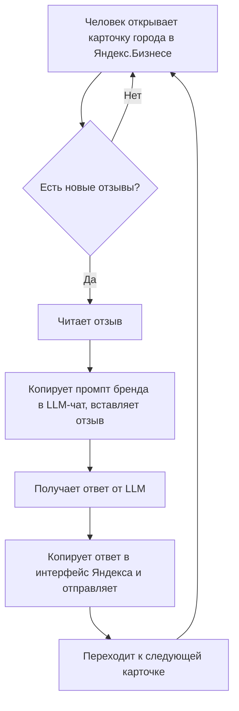
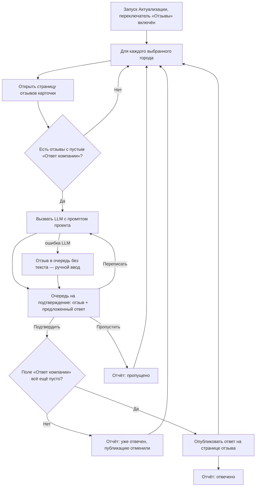
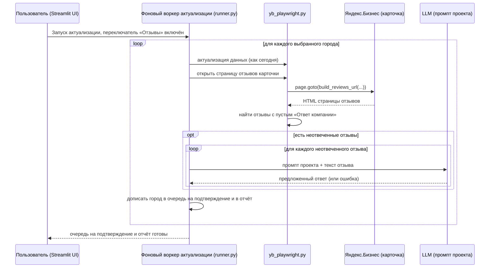
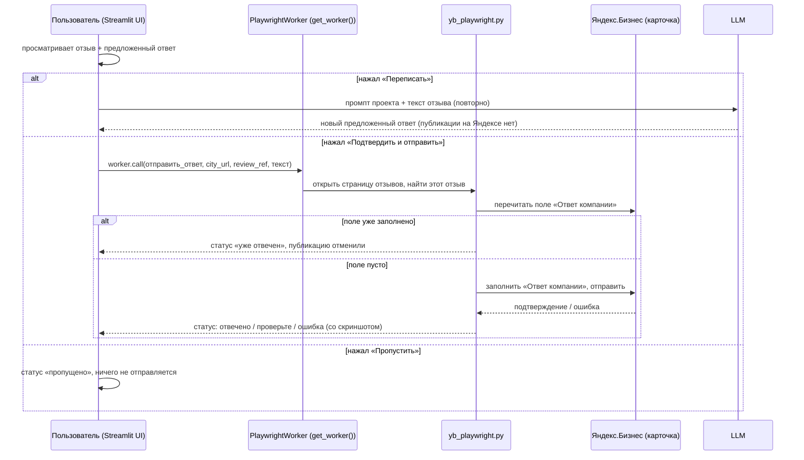

# Постановка: Отзывы в Click — поиск и ответ на неотвеченные отзывы с подтверждением

> Раздел не применим — помечен `N/A` с причиной, не удалён. Нумерация фиксирована для трассировки между разделами документа.
>
> **Редакция 2 (2026-08-04).** Первая редакция описывала Click по устаревшему `README.md`. Здесь всё сверено с кодом: проектов пять, а не три; СМУ — это Стальметурал; МПИ и АПС уже заведены. Что именно изменилось — в разделе 17.

---

## 0. Шапка

| Поле | Значение |
|---|---|
| **Jira** | N/A — проект Autopilot вне ARAG/корпоративного трекера, отдельного тикета нет |
| **Vision / BRD** | N/A — формального документа нет; основа постановки — переписка в Telegram, код Click и документ с готовыми промптами |
| **Описание** | В «Актуализацию» Click добавляется опциональный шаг: находить неотвеченные отзывы на карточках Яндекс.Бизнеса, предлагать ответ через LLM по промпту проекта, публиковать только после подтверждения человеком |
| **Зависимости** | Проект Click (миграция Node→Python завершена; доработки из `PLAN.md` идут параллельно и не блокируют эту фичу) |
| **Заказчик** | Маркетинг-партнёр Autopilot (ведёт SMM и отзывы клиентских карточек) |
| **Автор постановки** | Vladislav |
| **Дата создания** | 2026-08-04 |
| **Статус документа** | Draft, редакция 2 |

---

## 1. Контекст и бизнес-цель

- **Бизнес-проблема:** ответы на отзывы на карточках Яндекс.Бизнеса — полностью ручной процесс. Промпт под бренд написан **для всех пяти проектов Click** (см. 2.2 и 3), но масштаба это не решает: человеку всё равно приходится вручную обойти карточки в поисках неотвеченных отзывов, вставить каждый в промпт, прогнать через LLM, скопировать результат и вставить в Яндекс — и это на 60–144 города на бренд.
- **Бизнес-цель:** убрать ручной обход карточек и ручной перенос текста между LLM и Яндексом, не теряя контроль над тем, что публикуется под именем бренда — ответ уходит только после подтверждения человеком.
- **Метрика успеха (KPI):** черновая, точные цифры не согласованы — доля отзывов с ответом и среднее время от появления отзыва до ответа. Точные целевые значения — см. Q-7.
- **Срок / приоритет:** не зафиксирован. В обсуждении идею сначала предполагалось отложить («после чек-листов»), сейчас по факту в работе — приоритет считать SHOULD, если не будет сказано иначе.

---

## 2. Ключевые источники информации

### 2.1. Глоссарий

| Термин | Определение |
|---|---|
| Отзыв | Отзыв клиента на карточке компании в Яндекс.Бизнесе |
| Карточка | Профиль компании на Яндекс.Бизнесе для одного города/филиала |
| Актуализация | Существующий раздел Click, который заходит на карточку каждого города и жмёт «Данные актуальны» (порт `actualize.js`) |
| Проект | Один из брендов, которыми управляет Click как отдельным аккаунтом Яндекса (СМУ, ИМП, МПЭ, МПИ, АПС) |
| Промпт | Инструкция для LLM, настроенная отдельно на каждый проект, по которой формируется предложенный ответ на отзыв |
| Ассортиментная фраза | Фиксированная фраза о товарном ассортименте бренда, которую промпт обязан органично вписать в ответ — своя у каждого бренда |
| Предложенный ответ | Черновик ответа от LLM, который не публикуется, пока человек его не подтвердит |
| Очередь на подтверждение | Собранные за прогон пары «отзыв → предложенный ответ», ждущие решения человека |

### 2.2. Источники

- **Репозиторий Click (прочитан по коду, а не по README):** `streamlit_app.py`, `runner.py`, `yb_playwright.py`, `ui_theme.py`, `projects_data.py`, `repo_store.py`, `playwright_worker.py`, `paths.py`, `kp_sheet.py`, `tests_click.py`, `tests_runner_e2e.py`, `PLAN.md`, `ВЕРСИИ.md`
- ⚠️ **`README.md` устарел** и не является источником: в нём «три проекта» и «СМУ — Стальметгрупп», тогда как в коде пять проектов и СМУ — Стальметурал. Первая редакция этой постановки опиралась на README и из-за этого содержала неверные выводы. `README.md` нужно поправить в рамках этой же задачи (см. 5.1).
- Скриншоты переписки в Telegram с обсуждением идеи
- Скриншот карточки отзывов Яндекс.Бизнеса компании МетПромИнтекс — пример UI, откуда видно поле «Ответ компании» и штатные быстрые кнопки Яндекса
- Документ `ПРОМТЫ_на_отзывы.docx` — готовые промпты с примерами «отзыв → ответ» для пяти брендов: **Авиапромсталь** (официальный тон, строго 4 абзаца), **Инметпром** (живой, дружелюбный, единым блоком без «С уважением»), **Стальметурал** (подробный тон, ассортиментная фраза сразу после благодарности, а не в конце), **Метпромэнерго** (сухо, строго 2 абзаца), **МетПромИнтекс** (2–3 предложения, без обращения по имени и без слова «команда»)
- Прямые указания в этом чате

### 2.3. Заинтересованные стороны

| Сторона | Роль | Требования / интересы |
|---|---|---|
| Vladislav | Разработчик (весь стек) | Реализация вписывается в архитектуру Click без переписывания существующей публикации/актуализации |
| Маркетинг-партнёр Autopilot | Заказчик, ежедневный пользователь фичи, владелец контента промптов | Быстрые, качественные, разрешённые к публикации ответы под именем бренда; ничего не публикуется без её проверки |
| Клиентские бренды — все пять проектов Click | Конечные бенефициары | Своевременные, уместные ответы на отзывы под их именем — ошибка здесь репутационно дороже ошибки в посте |

**Проекты Click по факту кода** (`streamlit_app.py:80-103`) — и сопоставление с промптами из `ПРОМТЫ_на_отзывы.docx`:

| Код | Бренд в приложении | Города | Промпт на отзывы |
|---|---|---|---|
| `SMU` 🏗 | **Стальметурал** (юр. лицо Стальметгрупп; бренд переименован осознанно — коммит `0d7750c`) | 117, зашиты | ✅ есть — «Стальметурал» |
| `IMP` 🔩 | Инметпром | 144, зашиты | ✅ есть — «Инметпром» |
| `MPE` ⚡ | МетПромЭнерго | 142, зашиты | ✅ есть — «Метпромэнерго» |
| `MPI` 🛠 | МетПромИнтекс | из КП (Google-таблица) | ✅ есть — «МетПромИнтекс» |
| `APS` ✈ | Авиапромсталь | ~62, зашиты | ✅ есть — «Авиапромсталь» |

Соответствие **один к одному**: пять готовых промптов ложатся ровно на пять существующих проектов. Писать промпт с нуля не нужно ни для кого, заводить новые проекты — тоже.

---

## 3. Текущее состояние (As-Is)

В коде Click нет ничего, связанного с отзывами. Единственное вхождение слова «review» в репозитории — служебный `REVIEW.md` про код-ревью миграции; ни `отзыв`, ни `reviews` в коде не встречаются вообще.

Текст ответа при этом с нуля не пишется: для всех пяти брендов есть развёрнутые промпты. Судя по формату документа, они рассчитаны на ручную вставку в LLM-чат — человек копирует промпт под нужный бренд, дописывает туда текст конкретного отзыва и имя автора, получает ответ от LLM и переносит его в Яндекс.Бизнес руками.

**Известные ограничения:**
- Не масштабируется на 60–144 города на бренд — даже с готовым промптом поиск неотвеченных отзывов и перенос ответа остаются полностью ручными
- Нет единого списка «что осталось без ответа» — только обход карточек одна за другой
- Промпты живут в `.docx` на стороне заказчика, а не в приложении: их нельзя ни применить автоматически, ни версионировать

**Сценарий As-Is**

1. Человек вручную открывает карточку компании на Яндекс.Бизнесе для конкретного города.
2. Переходит на вкладку «Отзывы», визуально ищет отзывы без ответа компании.
3. Копирует промпт нужного бренда в LLM-чат, вставляет туда текст отзыва и имя автора, получает ответ.
4. Копирует полученный ответ в интерфейс Яндекса и отправляет.
5. Повторяет шаги 1–4 для следующего города — вручную, без общего списка того, что осталось.

**Диаграмма процесса (Mermaid — вместо BPMN/Miro: команда из 2 человек не использует для этого проекта отдельный BPMN-тулинг)**

---

## 4. Целевое состояние (To-Be)

Фича встраивается в существующий раздел **«🔄 Актуализация»** как опциональный переключатель — отдельного раздела или бота не заводим (прямое решение по итогам обсуждения: «надо засунуть эту фичу в актуализацию данных, например галочкой»).

При включённом переключателе для каждого выбранного города, помимо текущей логики актуализации, система заходит на страницу отзывов карточки, находит отзывы без ответа компании и формирует по каждому предложенный ответ через LLM — по промпту, настроенному для проекта этой карточки. Все пять промптов переносятся в конфиг проектов как стартовые данные, без изменения содержания.

Ничего не публикуется автоматически — каждый предложенный ответ проходит через экран подтверждения, где человек может отправить его как есть или запросить новый вариант («переписать»). По сути автоматизируется именно ручная часть As-Is — обход карточек и перенос текста между LLM и Яндексом, — а не сама генерация, которая и так происходит через LLM, но вне Click.

**Ключевые отличия от As-Is:** список неотвеченных отзывов собирается сам; копирование между LLM-чатом и Яндексом заменяется одним экраном подтверждения; публикация — тот же клик, но по уже готовому тексту, без ручного переноса; промпты живут в приложении и правятся из него.

**Сценарий To-Be**

1. Пользователь в разделе «Актуализация» выбирает города/проект как обычно и включает переключатель «Также проверить и ответить на отзывы».
2. Запускает прогон (как сегодня — `start_actualize`).
3. Для каждого города, вместе с текущей логикой `actualize_city`, система открывает страницу отзывов карточки и находит отзывы с пустым полем «Ответ компании».
4. Для каждого найденного отзыва вызывается LLM с промптом, настроенным для проекта этой карточки, — получается предложенный текст ответа.
5. Пары «отзыв → предложенный ответ» складываются в очередь на подтверждение — ничего не публикуется автоматически.
6. Пользователь просматривает предложенный ответ и может: (а) подтвердить — система переходит к этому конкретному отзыву на живой странице и публикует подтверждённый текст; (б) запросить «переписать» — новый вызов LLM, новый вариант показывается, ничего не публикуется; (в) пропустить отзыв в этом прогоне без ответа.
7. Перед самой отправкой система заново читает поле «Ответ компании» этого отзыва: если за время ожидания на него уже ответили — публикация отменяется, отзыв помечается «уже отвечен».
8. Итог отражается в отчёте прогона: сколько отзывов найдено / отвечено / пропущено по каждому городу.

**Альтернативный путь — LLM недоступен или вернул ошибку**
- Отзыв всё равно попадает в очередь, но без предложенного текста — вместо него открытое поле для ручного ввода. Обработка остальных отзывов и городов не прерывается.

**Диаграмма целевого процесса (Mermaid)**

---

## 5. Scope

### 5.1. Входит

- [ ] Переключатель в разделе «Актуализация», включающий обработку отзывов для выбранных городов в том же прогоне
- [ ] Определение неотвеченных отзывов на странице карточки (признак — пустое поле «Ответ компании»)
- [ ] Генерация предложенного ответа через LLM по промпту, настроенному отдельно для каждого проекта
- [ ] Экран проверки: отзыв + предложенный ответ + действия «Подтвердить и отправить» / «Переписать» / «Пропустить»
- [ ] Перепроверка поля «Ответ компании» непосредственно перед отправкой (защита от дубля)
- [ ] Публикация подтверждённого ответа на реальной странице конкретного отзыва
- [ ] Отчёт по прогону: найдено / отвечено / пропущено по каждому городу — вместе с правкой рендера отчётов в `ui_theme.py`
- [ ] Настройка промпта по проекту в приложении (по аналогии с редактором «Окончания постов»), с хранением через `repo_store` — чтобы правки переживали перезапуск облака
- [ ] Перенос пяти готовых промптов (Стальметурал, Инметпром, МетПромЭнерго, МетПромИнтекс, Авиапромсталь) в конфиг как стартовые данные — без изменения их содержания
- [ ] Новый раздел про отзывы в `README.md` **и заодно правка устаревших мест README**: «три проекта» → пять, «Стальметгрупп» → Стальметурал

### 5.2. НЕ входит (out of scope)

- Отдельный Telegram-бот — рассматривался в обсуждении, отклонён: фича идёт внутрь Click
- Полностью автоматическая публикация без подтверждения человеком — обсуждалась исходно, но итоговый флоу явно требует подтверждения/переписывания перед публикацией
- Автопостинг в соцсети (Instagram/VK и т.п.) — упоминался как отдельная идея, отложен на будущее
- Написание содержания промптов разработчиком — тон, ассортиментная фраза и ограничения это контентная работа маркетинг-партнёра. По факту не требуется: промпты готовы на все пять проектов
- Заведение новых проектов Click — не требуется: все пять брендов с промптами уже заведены (см. 2.3)
- Полная глубина истории отзывов / пагинация — не уточнено, см. Q-2
- Выбор и оплата конкретного LLM-провайдера — техническое решение, не согласовано, см. Q-1
- Ответы на отзывы вне Яндекс.Бизнеса (2ГИС, Google, Отзовик и т.п.)

### 5.3. Допущения

- Действующая сессия Яндекс.Бизнеса, уже используемая для публикации/актуализации, даёт доступ и к разделу «Отзывы» той же карточки — архитектурно ожидаемо (тот же аккаунт), но практически не проверено
- Адрес раздела отзывов строится из номера карточки так же, как «Посты» и «Фото» (`build_posts_url` / `build_photos_url`, `yb_playwright.py:129-191`), и так же может существовать в двух форматах (`/edit/` и `/p/edit/`) — точный путь не подтверждён, нужен доступ к живой карточке (см. Q-14)
- «Один шаблон», упомянутый изначально, на практике оказался набором из 5 разных, детально прописанных промптов per-проект (свой тон, структура и словарные ограничения на каждый) — не статичный текст с плейсхолдерами, подтверждено предоставленным документом
- Результат генерации — черновик; ничего не публикуется без явного клика пользователя
- Объём отзывов на карточку невелик (единицы), иначе стоимость и время прогона придётся пересматривать

### 5.4. Ограничения

- Новый функционал должен работать в рамках уже существующих механизмов Click: фоновый воркер актуализации (`runner.py:934`) для этапа сбора и `PlaywrightWorker`/`get_worker()` (`streamlit_app.py:554`) для синхронных действий из UI-потока — не отдельный сервис
- **Один браузер на сессию Яндекса.** Фоновый прогон держит свой `YbBrowser` под локом (`_acquire_lock`, `runner.py:269`), а `get_worker()` — это отдельный экземпляр браузера с тем же файлом сессии, и лок он не проверяет. Публикация ответов и идущий прогон не должны пересекаться (см. Q-9, R-6)
- На Streamlit Cloud нет постоянной файловой системы: всё, что должно пережить перезапуск контейнера (промпты, очередь на подтверждение), обязано сохраняться через `repo_store.py` — тем же способом, что окончания постов и города
- `requirements.txt` закреплён по версиям намеренно; новую библиотеку добавлять нежелательно. Вызов LLM разумно делать обычным HTTP-запросом через `requests` (уже в зависимостях), без SDK
- Ключ LLM хранится в секретах Streamlit, как `gcp_service_account_b64` (`kp_sheet.py:159-170`), и не попадает в репозиторий
- Параметры прогона в Click намеренно не настраиваются пользователем (`get_settings`, `streamlit_app.py:342`) — переключатель «Отзывы» это состояние экрана запуска, а не новая настройка

---

## 6. Требования

| # | Бизнес-требование (БТ) | Пользовательское требование (ПТ) | Функциональное требование (ФТ) | Нефункциональное требование (НФТ) |
|---|---|---|---|---|
| 1 | **БТ-1.** Бизнес ХОЧЕТ убрать ручной обход карточек и ручной перенос текста между LLM и Яндексом при ответах на отзывы, по всем городам, без потери контроля над публикуемым текстом | **ПТ-1.** Я, как человек, отвечающий за отзывы бренда, хочу видеть готовый список неотвеченных отзывов, чтобы не искать их вручную по десяткам карточек | **ФТ-1.** КОГДА пользователь запускает «Актуализацию» с включённым переключателем «Отзывы» для выбранных городов, система ДОЛЖНА для каждого города открыть страницу отзывов карточки и определить отзывы без ответа компании (по пустому полю «Ответ компании») | **НФТ-1.** Надёжность: шаг по отзывам не должен ломать уже работающий шаг актуализации данных для этого же города. Числовые пороги (латентность, тайминги) не заданы — TODO, см. Q-7 |
| 2 | | **ПТ-2.** Я хочу, чтобы система сама предлагала текст ответа в стиле, заданном для конкретного бренда, чтобы ответ соответствовал этому проекту, а не звучал как чужой шаблон | **ФТ-2.** КОГДА найден неотвеченный отзыв, система ДОЛЖНА сформировать предложенный ответ, вызвав LLM с промптом, настроенным для проекта этой карточки | **НФТ-2.** Изоляция: промпт одного проекта не должен применяться к отзывам другого проекта (по аналогии с уже разделёнными per-проект окончаниями постов) |
| 3 | | **ПТ-3.** Я хочу видеть отзыв и предложенный ответ рядом и одним действием либо отправить его, либо попросить переписать, чтобы контролировать, что публикуется от имени бренда | **ФТ-3.** КОГДА предложенный ответ показан, система ДОЛЖНА предоставить действия «Подтвердить и отправить», «Переписать» и «Пропустить». **ФТ-4.** КОГДА нажато «Переписать», система ДОЛЖНА повторно вызвать LLM и показать новый вариант, не публикуя ничего на Яндекс.Бизнесе. **ФТ-5.** КОГДА нажато «Подтвердить и отправить», система ДОЛЖНА перейти к этому отзыву на реальной странице карточки и опубликовать подтверждённый текст | |
| 4 | | **ПТ-4.** Я хочу быть уверен(а), что один отзыв не получит два разных ответа при повторных прогонах | **ФТ-6.** КОГДА отзыв уже имеет непустое поле «Ответ компании» (в т.ч. отвеченный этим же инструментом ранее), система НЕ ДОЛЖНА предлагать по нему ответ, а перед самой отправкой ДОЛЖНА перечитать это поле и отменить публикацию, если ответ там появился | **НФТ-3.** Идемпотентность обеспечивается состоянием самой страницы (наличие ответа); отдельный реестр дублей, как для постов (`.published.jsonl`), для MVP не требуется |
| 5 | | **ПТ-5.** Я хочу видеть после прогона, что произошло с отзывами, чтобы понимать, что сделано инструментом, а что осталось | **ФТ-7.** КОГДА прогон с шагом «Отзывы» завершён, система ДОЛЖНА показать отчёт: количество найденных / отвеченных / пропущенных отзывов по каждому городу | |
| 6 | | **ПТ-6.** Я хочу, чтобы сбой генерации ответа по одному отзыву не остановил всю обработку | **ФТ-8.** КОГДА вызов LLM завершился ошибкой или пустым ответом, система ДОЛЖНА показать отзыв без предложенного текста и дать возможность ввести ответ вручную, не прерывая обработку остальных отзывов и городов | |
| 7 | **БТ-2.** Бизнес ХОЧЕТ, чтобы собранная работа не пропадала между сеансами — иначе прогон на 140 городов придётся повторять | **ПТ-7.** Я хочу вернуться к очереди неподтверждённых ответов позже (в т.ч. после перезапуска приложения), а не подтверждать всё за один присест | **ФТ-9.** КОГДА собрана очередь на подтверждение, система ДОЛЖНА сохранить её так, чтобы она пережила перезапуск приложения, включая пересборку контейнера в облаке | **НФТ-4.** Хранение — через `repo_store` (ветка `click-data`), как города и окончания постов; локальный файл только как кэш |
| 8 | | **ПТ-8.** Я хочу править промпт бренда прямо в приложении, не трогая код и не прося разработчика | **ФТ-10.** КОГДА пользователь открыл настройку промпта проекта, система ДОЛЖНА показать текущий текст, дать его изменить, сохранить и вернуть к заводскому варианту | **НФТ-5.** Одновременная работа с браузером: интерактивная публикация ответа не должна запускаться, пока идёт фоновый прогон того же проекта (иначе два браузера на один файл сессии, см. Q-9) |

**Замечание по формулировкам:** НФТ-1 намеренно оставлен без цифр — конкретные значения никто не озвучил, придумывать их не стал (см. Q-7).

### 6.1. Требования сопровождения

- **Документация:** новый раздел в `README.md` Click по аналогии с «Как пользоваться» / «Статусы в отчёте», плюс правка устаревших мест (число проектов, имя бренда СМУ)
- **Дежурные / алерты:** N/A — соло-разработка без дежурной смены; ошибки видны в живом логе, как и у остальных прогонов Click
- **SLA / RTO / RPO:** N/A — внутренний инструмент агентства, не внешний сервис
- **Регулярные операции:** периодический пересмотр промпта по проекту — TODO кто и как часто, см. Q-5
- **Расходы:** оплата LLM-провайдера — новая регулярная статья, владельца и лимита нет, см. Q-1

---

## 7. Дизайн решения

### 7.1. Архитектура

N/A в формате Miro-доски — для этого проекта команда (Vladislav + маркетинг-партнёр) не ведёт отдельную архитектурную доску. Архитектура ниже — текстом и Mermaid-диаграммами вместо неё.

Новый функционал не создаёт отдельный сервис, а расширяет существующие слои Click:

- **UI (`streamlit_app.py`):** переключатель в `tab_actualize` (`:1453`); экран проверки/подтверждения предложенных ответов; редактор промпта проекта по образцу `_endings_editor` (`:1075`)
- **Оркестрация (`runner.py`):** шаг сбора отзывов и черновиков встраивается в `start_actualize` (`:899`) / `_actualize_worker` (`:934`), рядом с вызовом `yb.actualize_city`; логи через `_append_log` (`:191`), отчёт — в `reports-actualize/`
- **Браузер (`yb_playwright.py`):** новая `build_reviews_url()` по образцу `build_posts_url` (`:129`) и `alt_posts_url` (`:167`); функция чтения списка отзывов и определения неотвеченных; функция публикации ответа на конкретный отзыв. Клик — через локатор с пометкой элемента data-атрибутом, как предписывает `PLAN.md` 1.1, а не по координатам
- **Интерактивный канал (`playwright_worker.py` / `get_worker()`):** существующий синхронный вызов Playwright из UI-потока — им же проводится клик «Подтвердить и отправить» по одному отзыву, как сегодня идёт весь флоу входа в Яндекс
- **Рендер отчёта (`ui_theme.py`):** словари статусов (`:1094`, `:1138`) и `_ACT_TILES` (`streamlit_app.py:1778`) дополняются исходами по отзывам — без этого новые счётчики не отрисуются
- **Хранение (`repo_store.py`):** промпт проекта — отдельным ключом `reviews-prompt-{project_id}`, по образцу `endings-{project_id}`; очередь на подтверждение — ключом `reviews-queue-{project_id}`
- **Новый модуль генерации ответа:** HTTP-вызов LLM с промптом проекта + текстом отзыва → предложенный текст. Провайдер не выбран, см. Q-1

### 7.2. Затронутые компоненты

| Компонент | Тип изменения | Описание |
|---|---|---|
| `streamlit_app.py` | Изменение | Переключатель в `tab_actualize`; экран подтверждения/переписывания; редактор промпта проекта; передача флага в `save_actualize_tasks` (`:518`) и `start_actualize` |
| `runner.py` | Изменение | `start_actualize`/`_actualize_worker` дополняется опциональным шагом по отзывам; новые счётчики и раздел отчёта (найдено/отвечено/пропущено) |
| `yb_playwright.py` | Изменение + новое | `build_reviews_url()`; чтение неотвеченных отзывов; публикация ответа на конкретный отзыв; перепроверка поля перед отправкой (по образцу `check_post_already_exists`, `:740`) |
| `ui_theme.py` | Изменение | Статусы и плашки отчёта для исходов по отзывам |
| `repo_store.py` | Без изменений, переиспользуется | Новые ключи `reviews-prompt-*` и `reviews-queue-*` через существующие `load`/`save` |
| `playwright_worker.py` / `get_worker()` | Без изменений, переиспользуется | Синхронный канал для интерактивного клика «Подтвердить и отправить» |
| `projects_data.py` | Изменение | Пять готовых промптов как заводские значения по проектам |
| Новый модуль генерации ответа (напр. `llm.py`) | Новый | Вызов LLM, изоляция промпта по `project_id`, обработка ошибок и таймаутов |
| `tests_click.py`, `tests_runner_e2e.py` | Изменение | Разбор фикстуры страницы отзывов, сборка URL, сквозной прогон с заглушками LLM и браузера |
| `README.md` | Изменение | Новый раздел про отзывы + правка устаревших мест (пять проектов, Стальметурал) |
| Секреты Streamlit | Изменение | Ключ LLM-провайдера |

### 7.3. Методы

Контракт в формате OpenAPI — **N/A**: это не REST-сервис с внешним API, а функции внутри Streamlit-приложения и слой браузерной автоматизации. Ниже — два ключевых новых потока вместо «методов», каждый с UML Sequence (Mermaid) → сценарий → модель данных.

---

#### Поток A: сбор неотвеченных отзывов и генерация черновиков (фоновый шаг актуализации)

**(1) UML Sequence-диаграмма**

**(2) Сценарий**

1. Фоновый воркер для каждого выбранного города, если переключатель включён, после `actualize_city` открывает страницу отзывов через новую `build_reviews_url()`; при 404 пробует альтернативный формат адреса, как это делает публикация постов.
2. Считывает список отзывов, определяет неотвеченные по пустому полю «Ответ компании».
3. Для каждого неотвеченного отзыва вызывает LLM с промптом проекта этой карточки.
4. Если LLM вернул ошибку — отзыв всё равно попадает в очередь, но без текста (ФТ-8).
5. Результаты по городу пишутся в очередь на подтверждение и в отчёт прогона — по ходу, а не в конце, чтобы оборванный прогон не терял собранное.

**Альтернативные / ошибочные сценарии:**
- Страница отзывов не открылась (404 / редирект на логин) → город помечается ошибкой, как и в `actualize_city` сегодня; при сбое сохраняется скриншот (`_save_failure_screenshot`, `runner.py:670`)
- Промпт проекта пуст → отзывы собираются, но без черновиков, с понятной подсказкой «настройте промпт»
- LLM недоступен → см. ФТ-8
- На карточке отзывов больше, чем на первом экране → глубина сканирования не определена, см. Q-2

**(3) Модель данных**

| Сущность | Поля | Изменение |
|---|---|---|
| Отзыв (review item) | id/якорь отзыва на странице, автор, рейтинг, текст, дата, project_id, город, companyUrl, статус (`new` / `drafted` / `answered` / `skipped` / `already-answered` / `failed`), предложенный_ответ, финальный_ответ, время сбора | Новая структура. Хранение — `repo_store`, ключ `reviews-queue-{project_id}`; локальный файл в папке проекта как кэш. Отдельная БД не заводится |
| Промпт проекта | project_id, текст промпта | Новый ключ `reviews-prompt-{project_id}` в `repo_store`; заводское значение — в `projects_data.py` |

---

#### Поток B: подтверждение и публикация ответа на конкретный отзыв (интерактивно)

**(1) UML Sequence-диаграмма**

**(2) Сценарий**

1. Пользователь видит в интерфейсе пару «отзыв + предложенный ответ» из очереди на подтверждение.
2. «Переписать» → повторный вызов LLM, браузер не задействован, ничего не публикуется.
3. «Подтвердить и отправить» → синхронный вызов через `get_worker()` открывает страницу отзывов, находит именно этот отзыв, перечитывает поле «Ответ компании», и только если оно пусто — заполняет и отправляет.
4. «Пропустить» → отзыв помечается пропущенным в этом прогоне, из очереди убирается.
5. Результат сразу отражается в интерфейсе и в отчёте прогона.

**Альтернативные сценарии:**
- Публикация не подтвердилась однозначно (Яндекс может не дать чёткого ответа) → статус «Проверьте», как у публикации постов
- Отзыв успел получить ответ от другого человека между сбором и подтверждением → шаг 3 это ловит, публикации не происходит
- Идёт фоновый прогон этого же проекта → кнопка отправки заблокирована (НФТ-5, Q-9)
- Сессия Яндекса слетела → та же подсказка «войдите в Яндекс», что и в остальных разделах

**(3) Модель данных**

Использует ту же сущность «Отзыв», что и Поток A — обновляет поля `статус` и `финальный_ответ`.

---

## 8. Миграции и план выкатки

- **Тип релиза:** N/A в классическом смысле (canary/blue-green) — self-hosted инструмент на 1–2 пользователей; практически — обновление кода, ручная проверка перед использованием на всех проектах
- **Backward compatibility:** да — фича опциональна (переключатель выключен по умолчанию), существующая публикация/актуализация не меняется, если он не включён
- **Миграции данных:** новых обязательных миграций нет — промпты приезжают заводскими значениями в коде и подхватываются автоматически; очередь на подтверждение создаётся пустой
- **План раскатки:**
  1. Обкатка на 1–3 городах одного проекта, где точно есть неотвеченный отзыв (кандидат — МПИ: по нему есть скриншот карточки отзывов)
  2. Проверка полного цикла: сбор → черновик → переписать → подтвердить → опубликовано, глазами на живой карточке
  3. Прогон на полном одном проекте
  4. Включение на остальных проектах
- **Rollback-план:** выключить переключатель — фича полностью опциональна и не трогает существующую логику публикации/актуализации. Полный откат кода — по процедуре из `ВЕРСИИ.md` (ветка `rollback-good`)

---

## 9. Наблюдаемость и эксплуатация

### 9.1. Логи
Расширить существующий живой лог актуализации (`_append_log`, `runner.py:191`) записями по каждому найденному/отвеченному/пропущенному отзыву — тот же формат, что уже используется для городов. Отдельно логировать: не удалось открыть страницу отзывов, LLM не ответил, публикация отменена из-за появившегося ответа.

### 9.2. Метрики Prometheus
N/A — self-hosted Streamlit-инструмент без Prometheus-инфраструктуры.

### 9.3. Дашборды Grafana
N/A — по той же причине.

### 9.4. Алерты
N/A — нет дежурной смены; ошибки видны в живом логе и в отчёте при следующем открытии приложения.

### 9.5. Runbook
Короткий troubleshooting-раздел в `README.md` («не находит отзывы», «LLM не отвечает», «ответ не отправился») — по аналогии с существующим разделом «Про Streamlit Cloud».

---

## 10. Тестирование

### 10.1. Стратегия
Расширить существующие `tests_click.py` (логика без браузера — сборка URL отзывов, разбор «пустое поле ответа» на HTML-фикстуре, изоляция промптов по проектам) и `tests_runner_e2e.py` (сквозной прогон с браузером-заглушкой и заглушкой LLM — по аналогии с тем, как уже протестированы публикация и актуализация). В `tests_click.py` есть отдельный класс тестов на живых страницах (`test_actualize_click_on_real_page`, `:1019`) — по тому же образцу добавляется проверка страницы отзывов. Ручная проверка на реальной карточке обязательна перед использованием на боевых городах.

### 10.2. Тест-кейсы (high-level)

| ID | Сценарий | Привязка к ФТ | Ожидаемый результат | Приоритет |
|---|---|---|---|---|
| TC-1 | Happy path: карточка с 1 неотвеченным отзывом → предложен ответ → подтверждён → опубликован | ФТ-1, ФТ-2, ФТ-3, ФТ-5 | Отзыв получает ответ, отчёт показывает 1 отвечен | P0 |
| TC-2 | Карточка без неотвеченных отзывов | ФТ-1 | Город помечен «нет отзывов для ответа», прогон не падает | P1 |
| TC-3 | «Переписать» нажат один или несколько раз до подтверждения | ФТ-4 | Каждый раз новый вариант, ничего не публикуется до явного подтверждения | P0 |
| TC-4 | LLM возвращает ошибку/таймаут | ФТ-8 | Отзыв показан без предложенного текста, доступен ручной ввод, остальные отзывы/города обрабатываются дальше | P1 |
| TC-5 | Отзыв ответили вручную между сбором и подтверждением | ФТ-6 | Публикация отменена, статус «уже отвечен», дубля нет | P0 |
| TC-6 | Промпт проекта очищен пользователем | ФТ-2, ФТ-10 | Понятная подсказка «настройте промпт», а не молчаливый сбой | P2 |
| TC-7 | Переключатель «Отзывы» выключен | ФТ-1 | Прогон идёт ровно как сегодня, ни одного обращения к отзывам и к LLM | P0 |
| TC-8 | Приложение перезапущено с непустой очередью на подтверждение | ФТ-9 | Очередь на месте, черновики не потеряны | P1 |
| TC-9 | Промпт проекта A не применяется к отзывам проекта B | НФТ-2 | В запрос к LLM уходит промпт того проекта, чья карточка обрабатывается | P0 |
| TC-10 | Попытка отправить ответ во время идущего прогона | НФТ-5 | Отправка недоступна с понятным пояснением, второй браузер не поднимается | P1 |

### 10.3. Нагрузочное тестирование
N/A для MVP — число городов на бренд (60–144) сопоставимо с уже работающей публикацией. Отдельно стоит замерить, насколько прогон удлиняется из-за вызовов LLM (Q-7).

---

## 11. Критерии приёмки (AC / DoD)

- [ ] Все ФТ-1…ФТ-10 реализованы и вручную проверены на реальной карточке
- [ ] Переключатель «Отзывы» не меняет поведение прогона, если выключен (обратная совместимость)
- [ ] Ни один ответ не публикуется без явного «Подтвердить и отправить»
- [ ] «Переписать» не публикует ничего на Яндекс.Бизнесе
- [ ] Один и тот же отзыв не получает два разных ответа при повторных прогонах
- [ ] Промпт настраивается отдельно на каждый проект и не путается между проектами
- [ ] Пять готовых промптов перенесены как заводские значения без изменения содержания
- [ ] Очередь на подтверждение переживает перезапуск приложения
- [ ] Ключ LLM живёт в секретах, в репозиторий не попадает
- [ ] `tests_click.py` / `tests_runner_e2e.py` дополнены и проходят зелёными
- [ ] `README.md` обновлён разделом про отзывы и исправлен в части числа проектов и имени бренда СМУ
- [ ] Продемонстрировано минимум на одном реальном проекте с реальными отзывами

---

## 12. Открытые вопросы

| # | Вопрос | Владелец | Срок | Статус | Решение / комментарий |
|---|---|---|---|---|---|
| Q-1 | Какой LLM-провайдер и API-ключ использовать для генерации ответа? | Vladislav | — | НУЖНО УТОЧНИТЬ | Блокирует разработку генерации |
| Q-2 | Глубина сканирования страницы отзывов — только первый экран или вся пагинация/история? | Vladislav | — | НУЖНО УТОЧНИТЬ | Предложение по умолчанию: только неотвеченные с первого экрана, пагинацию не трогаем |
| Q-3 | Заводить ли МетПромИнтекс, Авиапромсталь и Стальметурал проектами Click? | — | 2026-08-04 | РЕШЕНО | Не требуется: МПИ и АПС уже заведены, а Стальметурал — это и есть проект СМУ (`streamlit_app.py:80-103`) |
| Q-4 | Нужна ли кнопка «Пропустить» отзыв в текущем прогоне? | Vladislav | — | РЕШЕНО | Да, включена в ФТ-3: без неё зависший отзыв нельзя убрать из очереди |
| Q-5 | Как обрабатывать негативные/спорные отзывы — тот же промпт на все отзывы, или отдельная логика/эскалация человеку при низкой оценке? | маркетинг-партнёр | — | НУЖНО УТОЧНИТЬ | Не блокирует MVP: подтверждение человеком уже страхует |
| Q-6 | Как перепроверять «отзыв уже отвечен кем-то другим» перед публикацией? | Vladislav | 2026-08-04 | РЕШЕНО | Перечитывать поле «Ответ компании» непосредственно перед отправкой, по образцу `check_post_already_exists` (`yb_playwright.py:740`). Внесено в ФТ-6 и Поток B |
| Q-7 | Целевые числа для метрики успеха и допустимое удлинение прогона из-за LLM | Vladislav + маркетинг-партнёр | — | НУЖНО УТОЧНИТЬ | — |
| Q-8 | Кто и когда пишет промпт для СМУ? | — | 2026-08-04 | РЕШЕНО | Не требуется: СМУ = Стальметурал, промпт для него есть в `ПРОМТЫ_на_отзывы.docx` |
| Q-9 | Когда можно публиковать подтверждённые ответы: только после завершения прогона или прямо во время него? | Vladislav | — | НУЖНО УТОЧНИТЬ | Предложение по умолчанию: только после завершения — два браузера на один файл сессии рискуют её испортить |
| Q-10 | Сколько отзывов максимум брать за один прогон (стоимость LLM и время)? | Vladislav | — | НУЖНО УТОЧНИТЬ | Предложение: лимит на город, с явной пометкой в отчёте, если что-то не влезло |
| Q-11 | Что делать с отзывами без текста (только звёзды)? | маркетинг-партнёр | — | НУЖНО УТОЧНИТЬ | Варианты: пропускать, отвечать коротким шаблоном, отдавать человеку без черновика |
| Q-12 | Обращение по имени: часть промптов его требует, часть запрещает. Имя берём из карточки отзыва как есть? Что если его нет? | маркетинг-партнёр | — | НУЖНО УТОЧНИТЬ | — |
| Q-13 | Отвечать ли на старые неотвеченные отзывы (например, годичной давности) или только на свежие? | маркетинг-партнёр | — | НУЖНО УТОЧНИТЬ | — |
| Q-14 | Точный адрес и вёрстка раздела отзывов Яндекс.Бизнеса не подтверждены — нужен доступ к живой карточке с отзывом | Vladislav | — | НУЖНО УТОЧНИТЬ | Единственная по-настоящему неизвестная техническая часть |

---

## 13. Риски и митигация

| # | Риск | Вероятность | Влияние | Митигация |
|---|---|---|---|---|
| R-1 | Неуместный черновик ответа (особенно на негативный отзыв) публикуется под именем бренда | Средняя | Высокое | Обязательное подтверждение человеком перед публикацией (ФТ-3/ФТ-5); рассмотреть отдельный промпт/эскалацию для низких оценок (Q-5) |
| R-2 | Яндекс меняет вёрстку страницы отзывов / поле «Ответ компании» → селекторы ломаются | Средняя | Среднее | Тот же подход диагностики, что уже применяется в Click — скриншот + HTML-дамп при сбое (`PLAN.md` 1.6), плюс тесты на фикстуре в `tests_click.py` |
| R-3 | LLM-провайдер недоступен или дорог при большом объёме отзывов на 100+ городов | Низкая–средняя | Среднее | Fallback на ручной ввод (ФТ-8); лимит отзывов за прогон (Q-10); прикинуть стоимость до раскатки |
| R-4 | Дублирующийся ответ на один отзыв при повторных/параллельных прогонах | Низкая | Среднее | Перечитывание поля «Ответ компании» непосредственно перед публикацией (ФТ-6) |
| R-5 | Промпты содержат жёсткие словарные ограничения (у МетПромИнтекс название бренда ровно 1 раз и только в закрытии; у всех запрет на «база»/«склад»/«магазин») — LLM может их нарушить | Средняя | Низкое–среднее | Подтверждение человеком уже покрывает; при желании — автоматическая проверка ограничений до показа ответа |
| R-6 | Два браузера на один файл сессии Яндекса (фоновый прогон + интерактивная отправка) портят сессию или ловят разлогин | Средняя | Высокое | Блокировать отправку во время прогона (НФТ-5, Q-9); переиспользовать существующий лок |
| R-7 | Очередь черновиков теряется при перезапуске контейнера в облаке — работа на 140 городов пропадает | Высокая (без митигации) | Высокое | Хранение очереди через `repo_store` (ФТ-9, НФТ-4) |
| R-8 | Адрес/вёрстка раздела отзывов окажется непохожей на «Посты»/«Фото», и оценка вырастет | Средняя | Среднее | Сначала разведка на одной живой карточке (Q-14), только потом остальная разработка |

---

## 14. Оценка и план

### 14.1. Оценка трудоёмкости

| Роль | Объём |
|---|---|
| Vladislav (весь стек — сбор, генерация, UI подтверждения, публикация) | TODO — оценка не запрашивалась; давать её до разведки страницы отзывов (Q-14) смысла нет |
| Маркетинг-партнёр (контент промптов) | Не требуется — промпты готовы на все пять проектов |
| Остальные роли (Frontend/Backend/QA/DevOps отдельно) | N/A — команда из одного разработчика, все технические роли выполняет Vladislav |

### 14.2. Веховой план

| # | Веха | Срок | Ответственный |
|---|---|---|---|
| 1 | Постановка согласована, закрыты Q-1, Q-2, Q-9…Q-14 | TODO | Vladislav + маркетинг-партнёр |
| 2 | Разведка живой страницы отзывов: адрес, вёрстка, признак «нет ответа» | TODO | Vladislav |
| 3 | Выбран LLM-провайдер, реализован сбор отзывов + генерация черновика | TODO | Vladislav |
| 4 | Экран подтверждения/переписывания + публикация, проверено на 1 карточке | TODO | Vladislav |
| 5 | Обкатка на полном одном проекте, включение на остальных | TODO | Vladislav |

---

## 15. Согласования

| Роль | ФИО | Дата | Статус |
|---|---|---|---|
| Разработка | Vladislav | | ⬜ Согласовано |
| Заказчик / контент промптов | Маркетинг-партнёр Autopilot | | ⬜ Согласовано |

Роли «Архитектор / QA Lead / DevOps / Безопасность» — N/A, в команде нет отдельных людей на этих ролях.

---

## 16. Чек-лист самопроверки аналитика

- [x] Шапка заполнена — адаптированно, без Jira/Vision (проект вне ARAG)
- [x] Бизнес-цель обозначена; метрика успеха черновая, точные числа не заданы (Q-7)
- [x] Источники (раздел 2) перечислены, факты сверены с кодом, а не с README
- [x] As-Is описан со сценарием и диаграммой (Mermaid вместо BPMN — тулинг не используется в этом проекте)
- [x] To-Be описан со сценарием и диаграммой (Mermaid вместо BPMN)
- [x] Scope: явно указано, что не делаем
- [x] Таблица требований — цепочки БТ→ПТ→ФТ→НФТ, ID из редакции 1 сохранены
- [x] Все ФТ в формате «КОГДА…ДОЛЖНА…»; числа в НФТ не выдуманы там, где их не было
- [ ] Архитектура не в Miro — N/A для этого проекта, замена — текст + Mermaid
- [x] Затронутые компоненты перечислены с реальными именами файлов и строк
- [x] Для 2 ключевых потоков — UML Sequence (Mermaid) + сценарий + модель данных; контракт OpenAPI — N/A, не REST-сервис
- [x] План выкатки + rollback указаны
- [ ] Prometheus / Grafana / алерты — N/A, инфраструктуры нет; вместо этого живой лог и отчёт прогона
- [x] 10 тест-кейсов с привязкой к ФТ
- [x] DoD (раздел 11) заполнен
- [x] Открытые вопросы — 14, из них 4 закрыты, у остальных владелец и статус
- [x] Риски — 8, с митигацией
- [ ] Оценка трудоёмкости не дана — зависит от разведки страницы отзывов, не выдумана
- [ ] Согласующие — только 2 реальные стороны; роли Архитектор/QA/DevOps/Security — N/A для команды из 2 человек

---

## 17. Что изменилось относительно редакции 1

| Где | Было (редакция 1) | Стало (сверено с кодом) |
|---|---|---|
| 2.3, 5.2, Q-3 | «Три проекта Click: СМУ, ИМП, МПЭ. МетПромИнтекс, Авиапромсталь и Стальметурал проектами не заведены» | Пять проектов: SMU, IMP, MPE, MPI, APS (`streamlit_app.py:80-103`). МПИ и АПС заведены, промпты ложатся 1:1 |
| 1, 3, 4, 5.2, Q-8, веха 4 | «СМУ = Стальметгрупп, промпта на отзывы для него нет, надо написать» | СМУ = **Стальметурал** (`fullName`, почта `stalmetural19@yandex.ru`, хэштег `#Стальметурал`; коммит `0d7750c`). Промпт для него есть. Вся линия «написать промпт для СМУ» снята |
| 2.2 | `README.md` как источник | README помечен устаревшим и сам попал в scope правки |
| 5.1, 7.1, 7.2 | «Настройка промпта в разделе Настройки, по аналогии с Шаблонами по типам постов» | В коде это не вкладка настроек, а диалог «Окончания постов» (`_endings_editor`, `streamlit_app.py:1075`); промпт хранится отдельным ключом `repo_store`, а не полем в `projects-config.json` (`_KEPT`, `:185`) |
| 7.2 | `ui_theme.py` не упомянут | Добавлен: без правки словарей статусов (`:1094`, `:1138`) новые счётчики отчёта не отрисуются |
| 5.4, 6 (НФТ-5), Q-9, R-6 | Конфликт «фоновый прогон + интерактивный браузер» не рассматривался | Явно зафиксирован: `get_worker()` поднимает второй браузер на тот же файл сессии и лок прогона не проверяет |
| 6 (ФТ-9, НФТ-4), Q-10, R-7 | Очередь на подтверждение — «в рамках файлового хранилища Click» | В облаке файлы не переживают перезапуск: очередь хранится через `repo_store`, иначе работа на 140 городов теряется |
| 5.4 | Про зависимости и секреты ничего | Зафиксировано: `requirements.txt` закреплён по версиям, LLM звать через `requests`; ключ — в секретах Streamlit, как `gcp_service_account_b64` |
| 12 | 8 вопросов | 14: Q-3, Q-4, Q-6, Q-8 закрыты; добавлены Q-9…Q-14 |
| 10.2 | 6 тест-кейсов | 10: добавлены выключенный переключатель, перезапуск с очередью, изоляция промптов, отправка во время прогона |
